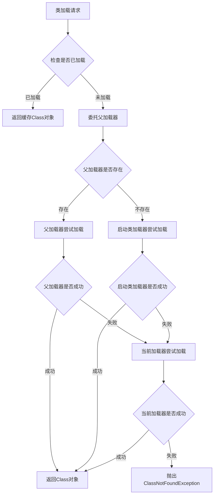
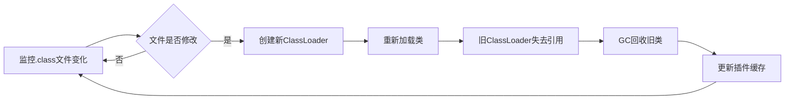
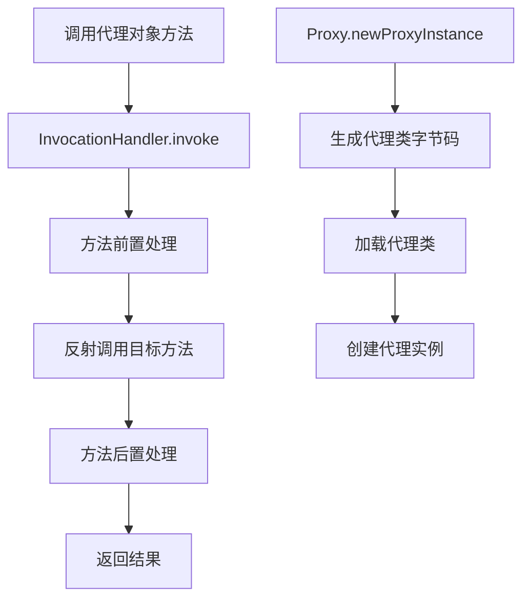
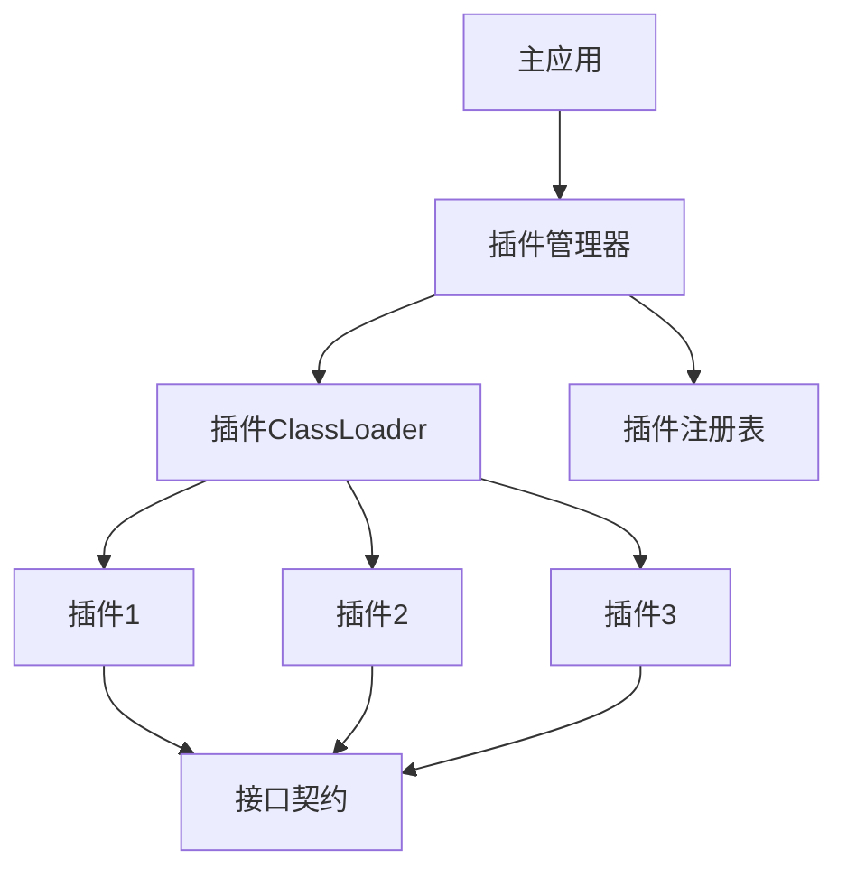

# Scorpio-Java：Java 核心技术深度实践

Scorpio-Java 是一个面向 Java 开发者的系统化学习项目，以代码实践为核心，从底层原理重新构建对 Java 核心技术的理解。项目采用 Maven 多模块架构（基于 Java 21），每个模块聚焦一个核心技术领域，通过完整的代码实现配套详细的技术文档，深入剖析原理、常见陷阱与最佳实践。

## 一、核心学习领域

### 1.1 类加载器机制（scorpio-classload）

深入理解 JVM 类加载体系，掌握类加载器的核心原理与实践应用。

#### 1.1.1 双亲委派模型

理解 ClassLoader 层级结构、委托机制及其设计初衷。

**核心流程：**



**类加载器层级：**

```
Bootstrap ClassLoader (启动类加载器)
    ↓
Platform ClassLoader (平台类加载器，Java 9+)
    ↓
App ClassLoader (应用类加载器)
    ↓
Custom ClassLoader (自定义类加载器)
```

**核心代码示例：**

```java
// 查看类加载器层级
ClassLoader classLoader = Main.class.getClassLoader();
System.out.println("当前类加载器: " + classLoader);  // AppClassLoader
System.out.println("父加载器: " + classLoader.getParent());  // PlatformClassLoader

// 加载目标类
Class<?> targetClass = classLoader.loadClass("com.zhoubyte.plugins.CalcHouseAgent");
System.out.println("目标类加载器: " + targetClass.getClassLoader());  // AppClassLoader
```

#### 1.1.2 自定义 ClassLoader 实现

从零实现 SecureClassLoader，掌握 `loadClass()` 与 `findClass()` 的协作机制。

**核心实现：**

```java
public class CalcPluginsClassLoad extends SecureClassLoader {
    
    private final Path classRootDir;
    private static final String PLUGINS_PACKAGE = "com.zhoubyte.plugins";
    
    @Override
    public Class<?> loadClass(String name) throws ClassNotFoundException {
        synchronized (getClassLoadingLock(name)) {
            // 1. 先查缓存
            Class<?> cached = findLoadedClass(name);
            if (cached != null) {
                return cached;
            }
            
            // 2. plugins包下的类打破双亲委派，直接自己加载
            if (name.startsWith(PLUGINS_PACKAGE) && !name.equals(PLUGINS_INTERFACE)) {
                return findClass(name);
            }
            
            // 3. 其他类走标准双亲委派
            return super.loadClass(name);
        }
    }
    
    @Override
    protected Class<?> findClass(String name) throws ClassNotFoundException {
        // 将类名转为文件路径，读取字节码
        String relativePath = name.replace('.', '/') + ".class";
        Path classFile = classRootDir.resolve(relativePath);
        byte[] classBytes = Files.readAllBytes(classFile);
        
        // 将字节码注册为Class对象
        return defineClass(name, classBytes, 0, classBytes.length);
    }
}
```

**关键点：**
- `loadClass()`：控制加载流程，决定是否委托父加载器
- `findClass()`：实际的类加载逻辑，读取字节码并定义Class对象
- `defineClass()`：将字节码转换为Class对象，JVM负责验证和链接

#### 1.1.3 打破双亲委派

实现插件化架构，理解何时以及如何安全地绕过双亲委派模型。

**应用场景：**
- 插件化系统：不同插件使用不同的ClassLoader，实现类隔离
- 热部署：重新加载修改后的类，无需重启JVM
- 依赖隔离：同一应用的不同模块依赖同一库的不同版本

**打破双亲委派的核心代码：**

```java
// 只对plugins包打破双亲委派，其他类仍走标准流程
if (name.startsWith(PLUGINS_PACKAGE) && !name.equals(PLUGINS_INTERFACE)) {
    return findClass(name);  // 直接自己加载，不委托父加载器
}
```

**注意事项：**
- 接口类必须由父加载器加载，否则会出现类型不兼容
- 打破双亲委派可能导致类重复加载和内存泄漏

#### 1.1.4 热加载原理

实现运行时类重载，理解 ClassLoader 生命周期、Metaspace 卸载机制与 GC 回收条件。

**热加载流程：**



**核心实现：**

```java
public class HotReloadTool {
    private volatile CalcPluginsClassLoad currentLoader;
    private volatile Map<String, CalcInterface> pluginCache = new HashMap<>();
    
    public void reloadAll() {
        // 1. 创建新的ClassLoader（旧的自动失去引用）
        CalcPluginsClassLoad newLoader = new CalcPluginsClassLoad(classRootDir, parentClassLoader);
        
        // 2. 扫描并加载所有插件
        Map<String, CalcInterface> newPlugins = new HashMap<>();
        try (Stream<Path> stream = Files.list(pluginsDir)) {
            for (Path classFile : stream.filter(p -> p.toString().endsWith(".class")).toList()) {
                String className = extractClassName(classFile);
                Class<?> clazz = newLoader.loadClass(className);
                
                if (CalcInterface.class.isAssignableFrom(clazz) && !clazz.isInterface()) {
                    CalcInterface plugin = (CalcInterface) clazz.getConstructor().newInstance();
                    newPlugins.put(className, plugin);
                }
            }
        }
        
        // 3. 原子替换ClassLoader和插件缓存
        this.currentLoader = newLoader;
        this.pluginCache = newPlugins;
    }
}
```

**GC回收条件：**
1. Class对象的所有实例被回收
2. Class对象本身被回收（没有引用指向它）
3. ClassLoader对象被回收
4. Class对象的Class对象被回收（元数据）

#### 1.1.5 JAR 包动态加载

使用 URLClassLoader 和 JarFile API 实现运行时 JAR 扫描与类加载。

**核心代码：**

```java
public static Map<String, Class<?>> scanJarClasses(String jarPath) throws Exception {
    Map<String, Class<?>> classMap = new HashMap<>();
    File jarFile = new File(jarPath);
    
    try (URLClassLoader loader = new URLClassLoader(new URL[]{jarFile.toURI().toURL()});
         JarFile jar = new JarFile(jarFile)) {
        
        Enumeration<JarEntry> entries = jar.entries();
        while (entries.hasMoreElements()) {
            JarEntry entry = entries.nextElement();
            String name = entry.getName();
            
            if (name.endsWith(".class") && !name.startsWith("META-INF/")) {
                String className = name.replace('/', '.').substring(0, name.length() - 6);
                Class<?> clazz = loader.loadClass(className);
                classMap.put(className, clazz);
            }
        }
    }
    return classMap;
}
```

**使用示例：**

```java
String jarPath = "/path/to/plugin.jar";
Map<String, Class<?>> classes = scanJarClasses(jarPath);
Class<?> pluginClass = classes.get("com.example.Plugin");
Object plugin = pluginClass.getConstructor().newInstance();
Method method = pluginClass.getMethod("execute", String.class);
Object result = method.invoke(plugin, "param");
```

#### 1.1.6 类型兼容性陷阱

深入理解"同一个类由不同 ClassLoader 加载会产生不同类型"的核心问题及其解决方案。

**问题演示：**

```java
// 使用AppClassLoader加载
Class<?> class1 = Main.class.getClassLoader().loadClass("com.zhoubyte.plugins.CalcHouseAgent");
Object obj1 = class1.getConstructor().newInstance();

// 使用URLClassLoader加载
URLClassLoader urlClassLoader = new URLClassLoader(new URL[]{url});
Class<?> class2 = urlClassLoader.loadClass("com.zhoubyte.plugins.CalcHouseAgent");
Object obj2 = class2.getConstructor().newInstance();

// 比较类型
System.out.println(class1 == class2);  // false - 不同类型！
System.out.println(class1.getClassLoader());  // AppClassLoader
System.out.println(class2.getClassLoader());  // URLClassLoader

// 强转会抛出ClassCastException
CalcHouseAgent agent = (CalcHouseAgent) obj2;  // ERROR!
```

**解决方案：**

1. **使用接口**：接口由父加载器加载，实现类由子加载器加载
```java
// 接口由AppClassLoader加载
CalcInterface plugin = (CalcInterface) obj2;  // OK!
```

2. **使用反射**：不依赖具体类型，通过反射调用方法
```java
Method method = class2.getMethod("calc", Double.class);
Object result = method.invoke(obj2, 1200D);
```

### 1.2 代理模式（scorpio-proxy）

掌握 Java 动态代理的核心原理与应用场景。

#### 1.2.1 静态代理 vs 动态代理

理解两种代理模式的本质区别与适用场景。

**静态代理：**
- 代理类在编译期确定，每个目标类都需要一个对应的代理类
- 优点：简单易懂，性能好
- 缺点：代码冗余，维护成本高

**动态代理：**
- 代理类在运行时动态生成，无需为每个目标类编写代理类
- 优点：灵活，代码简洁，易于扩展
- 缺点：性能略低于静态代理，调试困难

#### 1.2.2 JDK 动态代理

深入 Proxy 类与 InvocationHandler 接口的实现原理。

**核心流程：**



**核心代码：**

```java
// 定义InvocationHandler
public class LoggingHandler implements InvocationHandler {
    private Object target;
    
    public LoggingHandler(Object target) {
        this.target = target;
    }
    
    @Override
    public Object invoke(Object proxy, Method method, Object[] args) throws Throwable {
        // 前置处理
        System.out.println("[LOG] 调用方法: " + method.getName());
        
        // 调用目标方法
        Object result = method.invoke(target, args);
        
        // 后置处理
        System.out.println("[LOG] 返回结果: " + result);
        
        return result;
    }
}

// 创建代理对象
CalcInterface realObject = new CalcHouseAgent();
CalcInterface proxy = (CalcInterface) Proxy.newProxyInstance(
    realObject.getClass().getClassLoader(),
    realObject.getClass().getInterfaces(),
    new LoggingHandler(realObject)
);

// 使用代理
Double result = proxy.calc(1200D);
```

**关键点：**
- JDK动态代理只能代理接口，不能代理类
- 代理类继承Proxy类，实现目标接口
- 所有方法调用都转发到InvocationHandler.invoke()

#### 1.2.3 CGLIB 代理

理解基于继承的代理机制及其与 JDK 动态代理的差异。

**CGLIB vs JDK动态代理：**

| 特性 | JDK动态代理 | CGLIB代理 |
|------|------------|-----------|
| 代理方式 | 基于接口 | 基于继承 |
| 代理目标 | 必须实现接口 | 可以是普通类 |
| 性能 | 较低（反射调用） | 较高（字节码生成） |
| 限制 | 不能代理final方法 | 不能代理final类和方法 |
| 适用场景 | 接口代理 | 类代理 |

**核心代码：**

```java
// 定义MethodInterceptor
public class CglibProxy implements MethodInterceptor {
    @Override
    public Object intercept(Object obj, Method method, Object[] args, MethodProxy proxy) throws Throwable {
        // 前置处理
        System.out.println("[CGLIB] 调用方法: " + method.getName());
        
        // 调用目标方法（不使用反射）
        Object result = proxy.invokeSuper(obj, args);
        
        // 后置处理
        System.out.println("[CGLIB] 返回结果: " + result);
        
        return result;
    }
}

// 创建代理对象
Enhancer enhancer = new Enhancer();
enhancer.setSuperclass(CalcHouseAgent.class);
enhancer.setCallback(new CglibProxy());
CalcHouseAgent proxy = (CalcHouseAgent) enhancer.create();

// 使用代理
Double result = proxy.calc(1200D);
```

#### 1.2.4 代理在框架中的应用

Spring AOP、MyBatis Mapper 代理等核心机制解析。

**Spring AOP：**
- 默认使用JDK动态代理（如果目标类实现接口）
- 可配置使用CGLIB代理（如果目标类未实现接口）
- 通过代理实现事务管理、日志记录、权限控制等横切关注点

**MyBatis Mapper代理：**
- Mapper接口无需实现类，由动态代理生成实现
- 代理对象拦截方法调用，转换为SQL执行
- 核心机制：MapperProxyFactory + MapperProxy

### 1.3 设计模式实践

通过实际场景理解经典设计模式的应用。

#### 1.3.1 策略模式

插件化计算器架构，实现运行时算法切换。

**核心代码：**

```java
// 策略接口
public interface CalcInterface {
    Double calc(Double baseMoney);
}

// 具体策略：房屋计算
public class CalcHouseAgent implements CalcInterface {
    @Override
    public Double calc(Double baseMoney) {
        return (baseMoney + 200) * 1.2;
    }
}

// 具体策略：交通计算
public class CalcTransportationAgent implements CalcInterface {
    @Override
    public Double calc(Double baseMoney) {
        return baseMoney * 0.8;
    }
}

// 策略上下文
public class CalcContext {
    private CalcInterface strategy;
    
    public void setStrategy(CalcInterface strategy) {
        this.strategy = strategy;
    }
    
    public Double executeCalc(Double baseMoney) {
        return strategy.calc(baseMoney);
    }
}
```

**应用场景：**
- 插件化架构：运行时动态加载不同的计算策略
- 支付系统：支持多种支付方式（支付宝、微信、银行卡）
- 排序算法：根据数据规模选择不同的排序策略

#### 1.3.2 工厂模式

Class 对象的动态创建与管理。

**简单工厂：**

```java
public class PluginFactory {
    public static CalcInterface createPlugin(String pluginName) {
        try {
            Class<?> clazz = Class.forName("com.zhoubyte.plugins." + pluginName);
            return (CalcInterface) clazz.getConstructor().newInstance();
        } catch (Exception e) {
            throw new RuntimeException("创建插件失败: " + pluginName, e);
        }
    }
}
```

**应用场景：**
- 数据库连接池：根据配置创建不同类型的连接
- 日志框架：根据配置创建不同的日志实现

#### 1.3.3 模板方法模式

ClassLoader 的 loadClass 流程设计。

**核心流程：**

```java
// 抽象模板
public abstract class AbstractClassLoader extends ClassLoader {
    
    // 模板方法：定义加载流程骨架
    @Override
    public final Class<?> loadClass(String name) throws ClassNotFoundException {
        synchronized (getClassLoadingLock(name)) {
            // 1. 检查缓存
            Class<?> cached = findLoadedClass(name);
            if (cached != null) {
                return cached;
            }
            
            // 2. 委托父加载器（可由子类决定是否打破）
            if (shouldDelegateToParent(name)) {
                try {
                    return super.loadClass(name);
                } catch (ClassNotFoundException e) {
                    // 父加载器加载失败，继续
                }
            }
            
            // 3. 自己加载（由子类实现）
            return findClass(name);
        }
    }
    
    // 钩子方法：子类决定是否委托父加载器
    protected boolean shouldDelegateToParent(String name) {
        return true;  // 默认遵循双亲委派
    }
    
    // 抽象方法：由子类实现具体加载逻辑
    @Override
    protected abstract Class<?> findClass(String name) throws ClassNotFoundException;
}
```

**应用场景：**
- 类加载器：loadClass定义流程，findClass由子类实现
- Servlet生命周期：init → service → destroy
- Spring JdbcTemplate：定义流程，具体SQL由子类实现

#### 1.3.4 观察者模式

文件监控与热加载通知机制。

**核心代码：**

```java
// 观察者接口
public interface FileChangeListener {
    void onFileChanged(Path file);
}

// 被观察者：文件监控器
public class FileWatcher {
    private List<FileChangeListener> listeners = new ArrayList<>();
    
    public void addListener(FileChangeListener listener) {
        listeners.add(listener);
    }
    
    public void startWatch(Path directory) {
        WatchService watchService = FileSystems.getDefault().newWatchService();
        directory.register(watchService, StandardWatchEventKinds.ENTRY_MODIFY);
        
        while (true) {
            WatchKey key = watchService.take();
            for (WatchEvent<?> event : key.pollEvents()) {
                Path file = (Path) event.context();
                // 通知所有观察者
                for (FileChangeListener listener : listeners) {
                    listener.onFileChanged(file);
                }
            }
            key.reset();
        }
    }
}

// 具体观察者：热加载器
public class HotReloader implements FileChangeListener {
    @Override
    public void onFileChanged(Path file) {
        System.out.println("检测到文件变化: " + file);
        reloadAll();  // 触发热加载
    }
}
```

### 1.4 分布式系统基础

为后续分布式系统学习奠定基础。

#### 1.4.1 类隔离机制

理解容器化环境（如 Tomcat、OSGi）中的类加载隔离原理。

**Tomcat类加载架构：**

```
Bootstrap ClassLoader
    ↓
System ClassLoader
    ↓
Common ClassLoader (Tomcat核心类)
    ↓
    ├── Catalina ClassLoader (Tomcat内部类)
    └── WebApp ClassLoader (每个Web应用独立)
            ├── WebApp1 ClassLoader
            ├── WebApp2 ClassLoader
            └── ...
```

**隔离原理：**
- 每个WebApp使用独立的ClassLoader
- WebAppClassLoader打破双亲委派，优先加载WEB-INF/classes和WEB-INF/lib
- 不同WebApp可以依赖同一库的不同版本

**实现示例：**

```java
public class WebAppClassLoader extends URLClassLoader {
    @Override
    public Class<?> loadClass(String name) throws ClassNotFoundException {
        synchronized (getClassLoadingLock(name)) {
            // 1. 检查缓存
            Class<?> cached = findLoadedClass(name);
            if (cached != null) {
                return cached;
            }
            
            // 2. 对于Web应用自己的类，优先自己加载（打破双亲委派）
            if (name.startsWith("com.myapp")) {
                return findClass(name);
            }
            
            // 3. 对于JDK核心类，委托父加载器
            if (name.startsWith("java.") || name.startsWith("javax.")) {
                return super.loadClass(name);
            }
            
            // 4. 其他类，先自己尝试加载，失败再委托父加载器
            try {
                return findClass(name);
            } catch (ClassNotFoundException e) {
                return super.loadClass(name);
            }
        }
    }
}
```

#### 1.4.2 插件化架构

构建可扩展的插件系统，理解模块化设计的核心思想。

**插件化架构设计：**



**核心组件：**

1. **插件接口契约**：定义插件必须实现的接口
2. **插件管理器**：负责加载、卸载、管理插件生命周期
3. **插件ClassLoader**：实现插件隔离，每个插件使用独立的ClassLoader
4. **插件注册表**：维护插件元数据和实例

**应用场景：**
- IDE插件系统（Eclipse、IntelliJ IDEA）
- 微服务框架（Spring Boot Starter）
- 大数据平台（Flink、Spark）

#### 1.4.3 动态服务发现

基于反射和 ClassLoader 实现运行时服务注册与发现。

**服务注册与发现流程：**


**核心代码：**

```java
// 服务注册表
public class ServiceRegistry {
    private Map<String, Object> services = new ConcurrentHashMap<>();
    
    // 注册服务
    public void register(String serviceName, Object service) {
        services.put(serviceName, service);
    }
    
    // 发现服务
    public <T> T getService(String serviceName) {
        return (T) services.get(serviceName);
    }
    
    // 扫描并注册服务
    public void scanAndRegister(String basePackage, ClassLoader classLoader) {
        // 扫描包下所有类
        Set<Class<?>> classes = scanClasses(basePackage, classLoader);
        
        for (Class<?> clazz : classes) {
            if (clazz.isAnnotationPresent(Service.class)) {
                Object instance = clazz.getConstructor().newInstance();
                String serviceName = clazz.getSimpleName();
                register(serviceName, instance);
            }
        }
    }
}
```

**应用场景：**
- 微服务架构：服务注册中心（Eureka、Consul、Nacos）
- RPC框架：动态代理生成客户端存根
- 依赖注入：Spring IoC容器

## 二、学习特色

### 2.1 原理驱动

每个知识点从 JVM 规范和 JDK 源码层面深入剖析，不仅知其然，更知其所以然。

**示例：类加载器为什么使用双亲委派？**
- 安全性：避免核心类被篡改（如自定义java.lang.String）
- 唯一性：保证类的全局唯一性，避免重复加载
- 性能：父加载器加载的类可被所有子加载器共享

### 2.2 实践验证

所有概念配套可运行的代码示例，通过实际运行验证理论。

**验证方法：**
- 编写单元测试验证每个知识点
- 使用日志输出观察类加载过程
- 通过调试器跟踪代码执行流程
- 使用JVM参数观察类加载行为（-verbose:class）

### 2.3 陷阱警示

标注常见错误与性能陷阱，提供最佳实践指导。

**常见陷阱：**
1. **类加载器泄漏**：自定义ClassLoader未正确关闭导致内存泄漏
2. **类型转换异常**：同一类由不同ClassLoader加载导致ClassCastException
3. **死锁问题**：并行类加载时未正确使用getClassLoadingLock()
4. **性能问题**：频繁创建ClassLoader导致Metaspace溢出

### 2.4 渐进式学习

从基础概念到高级应用，构建完整的知识体系。

**学习路径：**
1. **基础篇**：理解类加载器层级、双亲委派模型
2. **进阶篇**：自定义ClassLoader、打破双亲委派、热加载
3. **高级篇**：类隔离、插件化架构、动态服务发现
4. **实战篇**：Tomcat类加载机制、Spring AOP原理、MyBatis Mapper代理