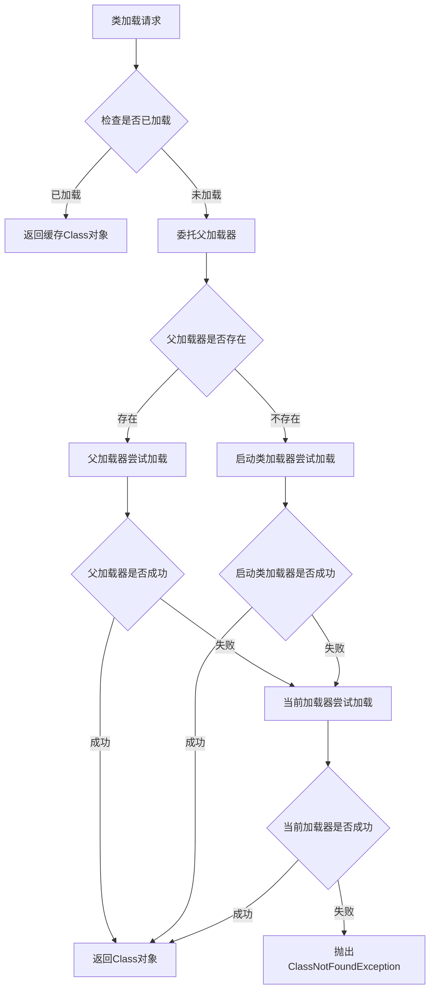
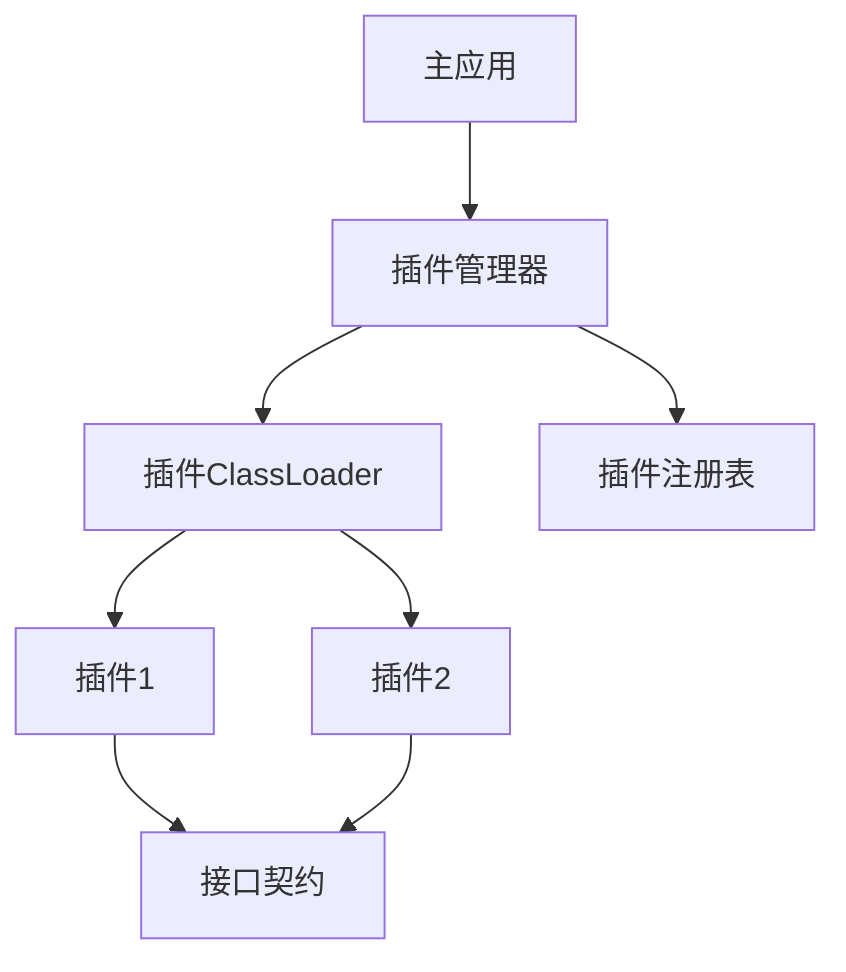

# Scorpio-Java：Java 核心技术深度实践

Scorpio-Java 是一个面向 Java 开发者的系统化学习项目，以代码实践为核心，从底层原理重新构建对 Java 核心技术的理解。项目采用 Maven 多模块架构（基于 Java 21），每个模块聚焦一个核心技术领域，通过完整的代码实现配套详细的技术文档，深入剖析原理、常见陷阱与最佳实践。覆盖类加载、动态代理、设计模式、分布式基础、Java AI 应用（Spring AI / Spring AI Alibaba / MCP）、文档处理与在线办公、Elasticsearch 检索实践、MyBatis-Plus 多表联查、Spring Cloud Stream 消息中间件，以及工作流引擎（Camunda / Flowable）等方向。

## 一、项目结构

```text
scorpio-java
├── scorpio-classload                  # 类加载机制：双亲委派、自定义 ClassLoader、热加载、JAR 动态加载
│   ├── classload-core                 #   核心实践（Main / tools / plugins / classloads）
│   └── jarclassload                   #   供动态加载的独立 JAR 插件
├── scorpio-proxy                      # 动态代理：JDK Proxy 与 CGLIB 两套完整实现
├── scorpio-ai                         # Java AI 应用实践（两条版本线，详见 2.5）
│   ├── spring-ai                      #   Spring Boot 4.1.0 + Spring AI 2.0.1
│   │   ├── core                       #     8080 /springAi：ChatClient、RAG、Tool、Advisor、MySQL 会话记忆
│   │   ├── mcp-server                 #     stdio / sse(8081) / stream(8083 /mcp) 三种协议的 MCP Server
│   │   └── mcp-client                 #     stdio-client / sse-client(8082) / stream-client(8084)
│   └── ai-alibaba                     #   Spring Boot 3.5.15 + Spring AI 1.1.2 + SAA 1.1.2.3
│       ├── alibaba-core               #     8090：ChatClient、流式、Redis 会话记忆、结构化输出、@Tool、Embedding
│       ├── alibaba-graph              #     8091：StateGraph 工作流编排 + ReactAgent
│       ├── alibaba-mcp-server         #     8092：电商 MCP Server（Streamable HTTP）
│       └── alibaba-mcp-client         #     8093：MCP Client + Ollama 模型调用
├── scorpio-aspose                     # 文档处理：Word/PDF 转换、表单检测、在线编辑（aspose-core）
├── scorpio-elastic                    # Elasticsearch：索引管理、文档 CRUD、动态文档、聚合统计
├── scorpio-mybatis-join               # MyBatis-Plus-Join 多表联查、p6spy SQL 观测
├── scorpio-cloud-stream               # Spring Cloud Stream：rabbit / kafka 两个独立子模块
└── workflow                           # 工作流引擎
    ├── camunda-bpmn                   #   Camunda：camunda_api(9527)、自定义 starter、合同流/采购流业务子模块
    └── scorpio-flowable               #   Flowable：流程操作、用户/组管理、任务监听器
```

**技术栈总览：**

| 领域 | 关键技术 | 版本说明 |
|------|--------|----------|
| 语言 / 构建 | Java 21 + Maven 多模块 | 全项目统一 |
| AI | Spring AI、Spring AI Alibaba、MCP、Ollama | 2.0.1 与 1.1.2 两条版本线并存 |
| 文档 | Aspose.Words / Aspose.PDF | 评估模式（有页数限制与水印） |
| 检索 | Elasticsearch + Spring ES Client | 独立模块 |
| ORM | MyBatis-Plus + mybatis-plus-join + p6spy | MySQL |
| 消息 | Spring Cloud Stream（RabbitMQ / Kafka Binder） | 子模块隔离 |
| 流程 | Camunda BPM 7 / Flowable | BPMN 2.0 |

## 二、核心学习领域

### 2.1 类加载器机制（scorpio-classload）

深入理解 JVM 类加载体系，掌握类加载器的核心原理与实践应用。核心代码位于 `classload-core`，按主题拆分为多个可独立运行的工具类：

| 实践文件 | 主题 |
|----------|------|
| `BasicClassLoadTool` | 类加载器层级与双亲委派观察 |
| `CustomClassLoadTool` + `CalcPluginsClassLoad` | 自定义 ClassLoader、打破双亲委派 |
| `HotReloadTool` | 文件监控与运行时热加载 |
| `JarClassLoadTool` / `UrlClassLoadTool` | JAR 包动态扫描与加载 |
| `plugins/CalcInterface` 等 | 插件接口契约与策略实现 |
| `Main` | 类型兼容性陷阱演示 |

#### 2.1.1 双亲委派模型

理解 ClassLoader 层级结构、委托机制及其设计初衷。

**核心流程：**


```mermaid
graph TD
    A[类加载请求] --> B{检查是否已加载}
    B -->|已加载| C[返回缓存Class对象]
    B -->|未加载| D[委托父加载器]
    D --> E{父加载器是否存在}
    E -->|存在| F[父加载器尝试加载]
    E -->|不存在| G[启动类加载器尝试加载]
    F --> H{父加载器是否成功}
    H -->|成功| I[返回Class对象]
    H -->|失败| J[当前加载器尝试加载]
    G --> K{启动类加载器是否成功}
    K -->|成功| I
    K -->|失败| J
    J --> L{当前加载器是否成功}
    L -->|成功| I
    L -->|失败| M[抛出ClassNotFoundException]
```

**类加载器层级：**

```
Bootstrap ClassLoader (启动类加载器)
    ↓
Platform ClassLoader (平台类加载器，Java 9+)
    ↓
App ClassLoader (应用类加载器)
    ↓
Custom ClassLoader (自定义类加载器)
```

**为什么使用双亲委派？**
- 安全性：避免核心类被篡改（如自定义 java.lang.String）
- 唯一性：保证类的全局唯一性，避免重复加载
- 性能：父加载器加载的类可被所有子加载器共享

#### 2.1.2 自定义 ClassLoader 与打破双亲委派

`CalcPluginsClassLoad` 继承 `SecureClassLoader`，只对插件包打破委派，其余类仍走标准流程：

```java
public class CalcPluginsClassLoad extends SecureClassLoader {

    private static final String PLUGINS_PACKAGE = "com.zhoubyte.plugins";

    @Override
    public Class<?> loadClass(String name) throws ClassNotFoundException {
        synchronized (getClassLoadingLock(name)) {
            // 1. 先查缓存
            Class<?> cached = findLoadedClass(name);
            if (cached != null) {
                return cached;
            }
            // 2. plugins 包下的类打破双亲委派，直接自己加载
            if (name.startsWith(PLUGINS_PACKAGE) && !name.equals(PLUGINS_INTERFACE)) {
                return findClass(name);
            }
            // 3. 其他类走标准双亲委派
            return super.loadClass(name);
        }
    }

    @Override
    protected Class<?> findClass(String name) throws ClassNotFoundException {
        String relativePath = name.replace('.', '/') + ".class";
        byte[] classBytes = Files.readAllBytes(classRootDir.resolve(relativePath));
        return defineClass(name, classBytes, 0, classBytes.length);
    }
}
```

**关键点：**
- `loadClass()` 控制加载流程，`findClass()` 实现具体加载逻辑，`defineClass()` 由 JVM 完成验证与链接
- 接口类必须由父加载器加载，否则会出现类型不兼容
- 打破双亲委派可能导致类重复加载和内存泄漏

#### 2.1.3 热加载原理

`HotReloadTool` 实现运行时类重载：监控 `.class` 文件变化 → 创建新 ClassLoader → 重新加载插件 → 原子替换缓存，旧 ClassLoader 失去引用后由 GC 回收。

**Metaspace 类卸载条件（缺一不可）：**
1. Class 对象的所有实例被回收
2. 没有引用指向该 Class 对象
3. 加载它的 ClassLoader 被回收
4. 该 Class 对象的 Class 对象（元数据）也被回收

**常见陷阱：** 频繁创建 ClassLoader 但旧实例仍被引用（如 ThreadLocal、静态缓存），导致 Metaspace 溢出。

#### 2.1.4 JAR 包动态加载

`JarClassLoadTool` 使用 `URLClassLoader` + `JarFile` 在运行时扫描 JAR 并加载类：

```java
try (URLClassLoader loader = new URLClassLoader(new URL[]{jarFile.toURI().toURL()});
     JarFile jar = new JarFile(jarFile)) {
    Enumeration<JarEntry> entries = jar.entries();
    while (entries.hasMoreElements()) {
        String name = entries.nextElement().getName();
        if (name.endsWith(".class") && !name.startsWith("META-INF/")) {
            String className = name.replace('/', '.').substring(0, name.length() - 6);
            Class<?> clazz = loader.loadClass(className);
        }
    }
}
```

`jarclassload` 模块（如 `com.zhoubyte.Sum`）就是被独立打包、供主程序动态加载的插件 JAR。

#### 2.1.5 类型兼容性陷阱

**同一个类由不同 ClassLoader 加载会产生不同类型：**

```java
Class<?> class1 = AppClassLoader.loadClass("com.zhoubyte.plugins.CalcHouseAgent");
Class<?> class2 = urlClassLoader.loadClass("com.zhoubyte.plugins.CalcHouseAgent");
System.out.println(class1 == class2);          // false —— 不同类型！
CalcHouseAgent agent = (CalcHouseAgent) obj2;  // ClassCastException!
```

**解决方案：**
1. **接口契约**：接口由父加载器加载，实现类由子加载器加载，向上转型到接口即可
   ```java
   CalcInterface plugin = (CalcInterface) obj2;  // OK
   ```
2. **反射调用**：完全不依赖具体类型，`getMethod` + `invoke`

### 2.2 代理模式（scorpio-proxy）

`scorpio-proxy` 提供 JDK 与 CGLIB 两套可运行的完整实现：

```text
scorpio-proxy
├── jdk_proxy      # JdkProxyLaunch + AdvancedInvocationHandler + UserProxy（接口代理）
└── cglib_proxy    # CglibProxyLaunch + CglibMethodInterceptor + ProxyFactory（类代理）
```

#### 2.2.1 JDK 动态代理

基于接口，运行时生成 `$ProxyN` 类，所有方法调用转发到 `InvocationHandler.invoke()`：

```java
public class AdvancedInvocationHandler implements InvocationHandler {
    private final Object target;

    @Override
    public Object invoke(Object proxy, Method method, Object[] args) throws Throwable {
        System.out.println("[LOG] 调用方法: " + method.getName());
        Object result = method.invoke(target, args);
        System.out.println("[LOG] 返回结果: " + result);
        return result;
    }
}

CalcInterface proxy = (CalcInterface) Proxy.newProxyInstance(
        realObject.getClass().getClassLoader(),
        realObject.getClass().getInterfaces(),
        new AdvancedInvocationHandler(realObject));
```

#### 2.2.2 CGLIB 代理

基于继承（`Enhancer` 生成目标类子类），无需目标实现接口；`MethodProxy.invokeSuper` 避免反射开销：

```java
Enhancer enhancer = new Enhancer();
enhancer.setSuperclass(UserService.class);
enhancer.setCallback(new CglibMethodInterceptor());
UserService proxy = (UserService) enhancer.create();
```

**JDK vs CGLIB：**

| 特性 | JDK 动态代理 | CGLIB 代理 |
|------|------------|-----------|
| 代理方式 | 基于接口 | 基于继承 |
| 代理目标 | 必须实现接口 | 可以是普通类 |
| 方法调用 | 反射 | 生成子类字节码 |
| 限制 | 不能代理类 | 不能代理 final 类/方法 |

#### 2.2.3 代理在框架中的应用

- **Spring AOP**：目标有接口默认 JDK 代理，无接口回退 CGLIB；用于事务、日志、权限等横切关注点
- **MyBatis Mapper**：Mapper 接口无实现类，由 `MapperProxyFactory` + `MapperProxy` 动态生成，方法调用被拦截转换为 SQL 执行

### 2.3 设计模式实践

设计模式不是独立模块，而是内嵌在 classload / proxy 插件化架构中的真实用法：

| 模式 | 落点 | 说明 |
|------|------|------|
| 策略模式 | `CalcInterface` + `CalcHouseAgent` / `CalcTransportationAgent` | 运行时切换计费算法，配合插件加载实现「算法可插拔」 |
| 工厂模式 | `Class.forName` + `getConstructor().newInstance()` 动态创建（HotReloadTool / JarClassLoadTool） | 按类名反射实例化插件，屏蔽创建细节 |
| 模板方法 | `ClassLoader.loadClass` 流程骨架 | 父类定义「缓存→委派→findClass」流程，`findClass` 留给子类 |
| 观察者 | `HotReloadTool` 文件监控通知 | 文件变化事件 → 通知所有监听者触发热加载 |

**策略模式核心结构：**

```java
public interface CalcInterface {           // 策略接口（契约）
    Double calc(Double baseMoney);
}

public class CalcContext {                 // 策略上下文
    private CalcInterface strategy;
    public Double executeCalc(Double baseMoney) {
        return strategy.calc(baseMoney);
    }
}
```

### 2.4 分布式系统基础

以类加载为切口，理解分布式与容器化环境的底层支撑机制：

#### 2.4.1 类隔离机制

Tomcat 每个 WebApp 使用独立 `WebAppClassLoader`，优先加载 `WEB-INF/classes` 与 `WEB-INF/lib`（打破双亲委派），实现：
- 不同应用依赖同一库的不同版本互不干扰
- JDK 核心类仍强制委托父加载器，保证安全

#### 2.4.2 插件化架构


```mermaid
graph TD
    A[主应用] --> B[插件管理器]
    B --> C[插件ClassLoader]
    B --> D[插件注册表]
    C --> E[插件1]
    C --> F[插件2]
    E --> H[接口契约]
    F --> H
```

核心组件：接口契约、插件管理器（生命周期）、独立 ClassLoader（隔离）、注册表（元数据）。应用范例：IDE 插件体系、Spring Boot Starter 机制、Flink/Spark 作业隔离。

#### 2.4.3 动态服务发现

基于反射 + 注解扫描实现运行时服务注册与发现（`ServiceRegistry.scanAndRegister`），与微服务注册中心（Nacos、Consul）、Spring IoC 容器的设计同源。

### 2.5 Java AI 应用实践（scorpio-ai）

基于 Spring AI 与 Spring AI Alibaba（SAA）的 AI 应用开发实践，模型统一接入本地 Ollama（对话：qwen2.5:3b-instruct，向量：nomic-embed-text），无需外部 API Key。项目分为两条版本线：

| 子项目 | 版本组合 | 定位 |
|--------|----------|------|
| `spring-ai` | Spring Boot 4.1.0 + Spring AI 2.0.1 | Spring AI 核心能力与 MCP 三协议实践 |
| `ai-alibaba` | Spring Boot 3.5.15 + Spring AI 1.1.2 + SAA 1.1.2.3 | 稳定版线：核心能力 + Graph 编排 + MCP 电商实战 |

#### 2.5.1 ChatClient 核心能力

Spring AI 面向应用层的统一对话入口，覆盖 LLM 应用的典型形态：

- **同步 / 流式调用**：`call()` 一次性返回；`stream()` 返回 `Flux<String>` 以 SSE 逐 token 推送
- **Prompt 模板**：`PromptTemplate` 与 ChatClient 的 `{占位符}` 参数注入（StringTemplate 引擎）
- **结构化输出**：`entity()` 依据目标类型（record）自动生成 JSON Schema 并反序列化，支持 `ParameterizedTypeReference` 列表输出
- **Tool 调用**：`@Tool` / `@ToolParam` 标注本地方法，模型按需发起 Function Calling
- **Embedding**：`EmbeddingModel` 文本向量化，支撑语义相似度与检索场景
- **自定义 Advisor**：`spring-ai/core` 中的 `SensitiveWordsAdvisor` 演示请求/响应切面扩展

#### 2.5.2 会话记忆持久化

对话记忆通过 Advisor 机制（`MessageChatMemoryAdvisor`）+ 滑动窗口（`MessageWindowChatMemory`）实现，存储后端可按需替换：

| 实现 | 所在模块 | 存储结构 |
|------|----------|----------|
| MySQL（JDBC） | `spring-ai/core` | 自研 `JdbcChatMemoryRepository`，消息表持久化 |
| Redis | `ai-alibaba/alibaba-core` | 自研 `RedisChatMemoryRepository`：每会话一个 List + 全局会话索引 Set + TTL 过期 |

**关键点：**
- `ChatMemoryRepository` 是存储扩展点，接口只有 4 个方法（查会话 ID / 查消息 / 全量覆盖保存 / 删除会话）
- 滑动窗口在 `MessageWindowChatMemory` 层裁剪（maxMessages），Repository 只负责存取
- spring-ai 1.1.2 无官方 Redis Repository（2.x 才提供），1.1.x 版本线需自实现
- 请求侧通过 `ChatMemory.CONVERSATION_ID` 参数区分会话，重启应用后记忆不丢失

#### 2.5.3 MCP 三协议实践（stdio / SSE / Streamable HTTP）

MCP（Model Context Protocol）把「模型能触达的外部能力」标准化为三类：**Tool（可执行）、Resource（只读数据）、Prompt（模板）**。

**服务端（spring-ai-starter-mcp-server-webmvc）：**

```java
@McpTool(name = "query_order", description = "根据订单号查询订单状态")
public OrderInfo queryOrder(@McpToolParam(description = "订单编号") String orderNo) { ... }

@McpResource(uri = "product://{productId}", name = "product-detail")
public String loadProduct(@McpArg(name = "productId") String productId) { ... }

@McpPrompt(name = "after-sale-answer", description = "售后问答模板")
public McpSchema.GetPromptResult afterSalePrompt(@McpArg(name = "question") String question) { ... }
```

**客户端（spring-ai-starter-mcp-client）：**

```yaml
spring.ai.mcp.client:
  streamable-http:            # 硬性约束：替代已弃用的 sse.connections 配置
    connections:
      alibaba-ecommerce-server:
        url: http://localhost:8092
```

**关键点：**
- Streamable HTTP 用单一 `/mcp` 端点承载 POST 与可选 SSE 流，协议由 `spring.ai.mcp.server.protocol` 控制（默认 streamable）
- 客户端 `toolcallback.enabled: true` 后，远程 Tool 自动注册为 `ToolCallbackProvider`，绑定 ChatClient 的 `defaultTools` 即可让模型远程调用
- Resource / Prompt 可通过 `McpSyncClient.readResource()` / `getPrompt()` 直连读取
- 注解包名注意版本差异：spring-ai 1.1.x 为 `org.springaicommunity.mcp.annotation.*`，2.x 为 `org.springframework.ai.mcp.annotation.*`

#### 2.5.4 Spring AI Alibaba Graph 工作流与 Agent

SAA Graph 提供有状态的多节点编排能力（`StateGraph` → `compile()` → `CompiledGraph`）：

- **顺序工作流**：`START → 生成提纲 → 撰写文章 → END`，节点间通过 `OverAllState` 传递数据
- **条件路由**：意图识别节点 + `addConditionalEdges`，按模型输出分流到售后 / 技术 / 咨询专员节点
- **流式执行**：`stream()` 返回 `Flux<NodeOutput>`，每完成一个节点即推送中间产物（SSE）
- **状态策略**：`KeyStrategyFactory` 按 key 声明合并规则（`ReplaceStrategy` 覆盖 / `AppendStrategy` 追加）
- **ReactAgent**：`builder().model().instruction().methodTools()` 即可构建「思考 → 工具调用 → 观察 → 回答」的 ReAct 闭环，支持 `call()` 同步与 `streamMessages()` 流式

**常见陷阱：**
1. ChatClient 忘记绑定 `ToolCallbackProvider`，导致模型「看不到」MCP 工具
2. 继续使用已弃用的 `sse.connections` 配置，引发「没有可用的 MCP Sync Client」
3. 小模型输出多余字符导致条件路由 key 匹配失败，需要对意图做归一化兜底
4. 结构化输出对提示词敏感，目标类型字段描述要清晰、示例问题要具体

**学完应能回答：**
- ChatClient 的 Advisor 链如何工作？会话记忆如何切换存储后端？
- MCP 的 Tool / Resource / Prompt 分别解决什么问题？三种传输协议如何选型？
- Streamable HTTP 相比 SSE 双端点方案的优势是什么？
- StateGraph 的状态合并策略与条件路由如何组合成复杂工作流？
- ReactAgent 与普通 ChatClient + tools 调用的区别是什么？

### 2.6 文档处理与在线办公（scorpio-aspose）

`aspose-core` 基于 Aspose.Words / Aspose.PDF 提供完整的文档处理能力，学习重点不在 API 清单，而在**业务能力模型**。

#### 2.6.1 在线文档的能力分层

| 能力 | 含义 | 学习重点 |
|------|------|----------|
| **Preview（预览）** | 只读渲染，不能改、不能存 | PDF 渲染、DOCX 只读展示、缩放翻页 |
| **Edit（编辑）** | 可改内容并落盘 | 编辑引擎选型、保存闭环、格式保真 |
| **Co-authoring（协同）** | 多人实时共编 | 冲突合并、OT/CRDT、会话与权限 |

「能打开」≠「能编辑」≠「能协同」，先想清楚目标落在哪一层，再谈技术选型。

#### 2.6.2 模块实际能力（按 Controller 划分）

| 接口组 | 能力 |
|--------|------|
| `WordToPdfController` / `PdfToWordController` | Word ↔ PDF 双向转换 |
| `WordToPictureController` / `PdfToPictureController` | 文档分页渲染为图片 |
| `WordDetectController` / `PdfDetectController` | 内容识别：文本查找、PDF 表单域枚举与填写 |
| `DocumentEditController` + `DocumentHtmlDto` | DOCX ↔ HTML 往返的浏览器编辑与保存闭环 |
| `UploadController` / `DocumentStorageService` | 文档上传与存储管理 |

**学习重点：**
- 把「文档」当成领域对象：输入格式、输出格式、填充模型、失败边界
- 模板契约设计：占位符（`{{name}}`）实现快但要注意半匹配、样式断裂；书签定位更稳，适合固定版式
- 保存闭环：打开 → 修改 → 写回原格式，缺任何一环都不是完整编辑
- HTML 往返适合「正文为主」的文档；页眉页脚、多栏、嵌入对象最容易失真

#### 2.6.3 常见陷阱与判断标准

1. **把预览当编辑**：验收标准应包含「改完再打开内容仍在」
2. **忽视保真度**：转换后版式变化是常态，要提前定义可接受损失
3. **授权与评估模式**：Aspose 未授权有页数限制与水印，容易误判为「功能坏了」
4. **选型与部署目标冲突**：既要桌面级排版，又拒绝部署 Document Server，两者很难同时满足

### 2.7 Elasticsearch 检索实践（scorpio-elastic）

完整的 ES 学习闭环，代码按职责分为索引、文档、聚合三组 Controller/Service，统一 `Result` 返回结构：

#### 2.7.1 索引管理（ElasticIndexController）

- 创建索引并写入 mapping、删除索引、判断存在性
- 查询 mapping 与索引列表、动态追加字段 mapping

**学习重点：** index / mapping / document 的职责边界；`text` 与 `keyword` 的差异；analyzer 对搜索结果的影响。

#### 2.7.2 文档 CRUD 与批量操作（ElasticDocumentController）

- `UserDocEntity` 固定实体：保存、按 ID 查询、更新、删除
- 批量保存 / 批量删除（`BatchUserDocumentRequest`）
- 分页、排序、关键词搜索与高亮返回（`UserHighlightResponse`）

#### 2.7.3 动态文档与聚合统计（ElasticAggregationController）

- 动态文档：请求传入 `indexName` + 字段 Map，运行时决定写入目标
- 聚合：年龄区间聚合（`AgeRangeAggregationRequest`）、动态字段 terms 统计（`FieldTermsAggregationRequest`）

**常见陷阱：**
1. 把 mapping 当表结构随意改：字段类型写入后修改受限
2. 忽略 text / keyword 差异：全文检索和精确聚合不是同一种字段模型
3. 错误直接暴露底层异常：Controller 层应统一返回结构

### 2.8 MyBatis-Plus 多表联查（scorpio-mybatis-join）

以「部门-员工-角色-档案」多表模型（`Dept` / `Employee` / `Role` / `EmployeeProfile` / `EmployeeRole`）实践 MyBatis-Plus 生态的联查插件（mybatis-plus-join）。

**核心能力：**
- Mapper 仍继承 `BaseMapper`，联查通过 `Joins` 包装器 + `JoinLambdaWrapper` 完成，不写 XML 即可多表 JOIN 与分页
- VO/DTO 映射：`EmployeeProfileVo`、`StatisticsDto` 承接联查结果，`pojo.entity.chain` 定义联查链式实体
- `ScorpioJoinService` 封装通用联查场景
- **p6spy**：`jdbc:p6spy:mysql://...` 数据源代理，打印真实执行 SQL 与耗时，直观观察「单表 Wrapper」与「JOIN 查询」的差异

**学习重点：**
- 何时用 MPJ 联查、何时用「多次单表查询 + 内存组装」
- `@TableField` / `exist = false` 等映射技巧在联查 VO 上的应用
- 分页 + JOIN 场景下 count 语句的坑

### 2.9 Spring Cloud Stream 消息中间件实践（scorpio-cloud-stream）

父聚合模块拆分为两个可独立启动的子模块，避免 binder 依赖与 binding 配置互相干扰：

```text
scorpio-cloud-stream
├── scorpio-cloud-stream-rabbit    # RabbitMQ Binder
└── scorpio-cloud-stream-kafka     # Kafka Binder
```

#### 2.9.1 RabbitMQ 子模块

REST 发送普通/批量/延迟消息（`RabbitDelayedMessageRequest`）、分组消费、死信队列（DLQ）演示。

#### 2.9.2 Kafka 子模块

REST 发送普通/批量消息、分区 key 发送、分组消费、错误处理与 DLQ 示例（`KafkaExceptionHandler`）。

#### 2.9.3 统一设计模式

两个子模块结构完全对称：`Controller`（接收请求）→ `Service + StreamBridge`（封装 bindingName 与 headers）→ `Consumer<Message<String>>`（函数式消费），binder 差异全部收敛在 `application.yaml`。

**学完应能回答：**
- binder 抽象解决了什么问题？`destination`、`group`、`bindingName` 分别表示什么？
- RabbitMQ（队列路由/任务分发）与 Kafka（日志型/可回放/分区有序）的消息模型差异
- 什么时候使用分区 key，什么时候使用死信队列？

### 2.10 工作流引擎（workflow）

BPMN 2.0 流程编排实践，覆盖 Camunda 与 Flowable 两大引擎：

```text
workflow
├── camunda-bpmn
│   ├── camunda_api                        # 9527：引擎 API 综合演示
│   ├── scorpio-camunda-bpmn-starter       # 自定义 Spring Boot Starter 封装
│   └── sub-modules
│       ├── contract_flow                  # 业务示例：合同审批流
│       └── procure_flow                   # 业务示例：采购流程（含工单）
└── scorpio-flowable                       # Flowable：流程操作 + 用户/组管理
```

#### 2.10.1 Camunda API 能力（camunda_api）

- **流程部署**：`DeployController` 部署 BPMN 定义
- **流程与实例操作**：`ProcessController` 流程发起、实例查询与推进
- **消息与事件**：`CamundaMessageController` 演示消息捕获、中间事件唤醒
- **定时与 Job**：`TimerCycleUtil` + `PurchaseWorkerJob` / `OverdueNoticeWorkerJob` / `AuditLogsWorkerJob`，掌握 Timer Boundary Event 与异步 Job Executor
- **执行实例观测**：`ElementInstanceController` 查询流程实例活动轨迹
- **业务落地**：合同流、采购流两个子模块演示「引擎能力 → 业务流程」的完整映射

#### 2.10.2 Flowable 实践（scorpio-flowable）

- `BasicOperatorController`：任务签收/完成、流程变量操作
- `BPMNUserController`：用户、组、组成员关系管理（Task Candidate 的基础）
- `TaskCreateListener`：任务创建监听器，演示候选人动态分配、通知类横切逻辑
- `DeployBPMN`：启动时自动部署流程定义

#### 2.10.3 学习重点与陷阱

1. **流程定义版本**：部署即产生新版本，运行中实例仍走旧版本定义
2. **消息关联**：correlation key 配错会导致消息事件永远唤不醒流程
3. **Job 与事务**：异步 Job 失败会重试并产生 incident，需要监控处理
4. **用户任务分派**：candidate（候选）与 assignee（受理人）语义不同
5. **引擎选型**：Camunda 社区版 API 更工程化，Flowable 与国内生态集成更多，BPMN 标准层面两者可互迁

**学完应能回答：**
- BPMN 网关（排他/并行）如何影响流程实例的推进？
- 消息事件、定时事件分别适合什么业务场景？
- 如何用 Starter 把引擎能力封装成团队内部组件？

## 三、学习特色

### 3.1 原理驱动

每个知识点从 JVM 规范和框架源码层面深入剖析，不仅知其然，更知其所以然。类加载从 `ClassLoader.loadClass` 源码出发，代理从字节码生成机制出发，AI 模块从自动配置与 Advisor 责任链出发，工作流从 BPMN 语义与令牌流转出发。

### 3.2 实践验证

所有概念配套可运行的代码示例与独立启动模块：
- 编写单元测试验证每个知识点
- 使用日志输出观察类加载过程（`-verbose:class`）
- AI 模块基于本地 Ollama，全部接口可 curl 验证
- p6spy 观察真实 SQL，ES / Redis / MySQL / MQ 均给出可复现的本地配置

### 3.3 陷阱警示

每个领域标注常见错误与性能陷阱：类加载器泄漏、ClassLoader 类型不兼容、MCP 弃用配置、Aspose 评估模式限制、ES mapping 变更限制、流程版本与消息关联坑等，并提供最佳实践指导。

### 3.4 渐进式学习

**学习路径：**
1. **基础篇**：类加载器层级、双亲委派模型、JDK/CGLIB 代理
2. **进阶篇**：自定义 ClassLoader、打破双亲委派、热加载、设计模式落地
3. **高级篇**：类隔离、插件化架构、动态服务发现
4. **数据与集成篇**：Elasticsearch 检索、MyBatis-Plus 联查、Spring Cloud Stream 消息中间件
5. **应用篇**：Java AI 应用实践（Spring AI 核心能力、MCP 三协议、SAA Graph 编排与会话记忆持久化）、文档自动化与在线办公能力分层（预览 / 编辑 / 协同）、工作流引擎（Camunda / Flowable）业务落地
