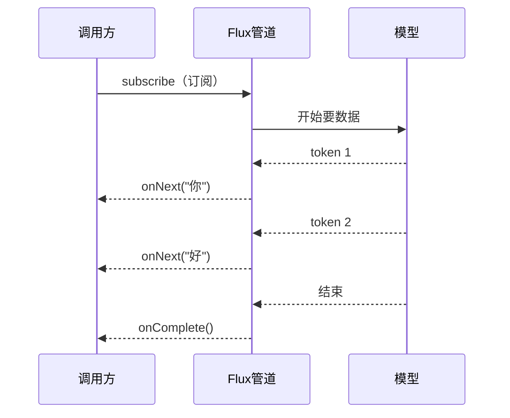
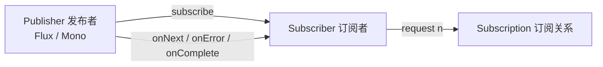
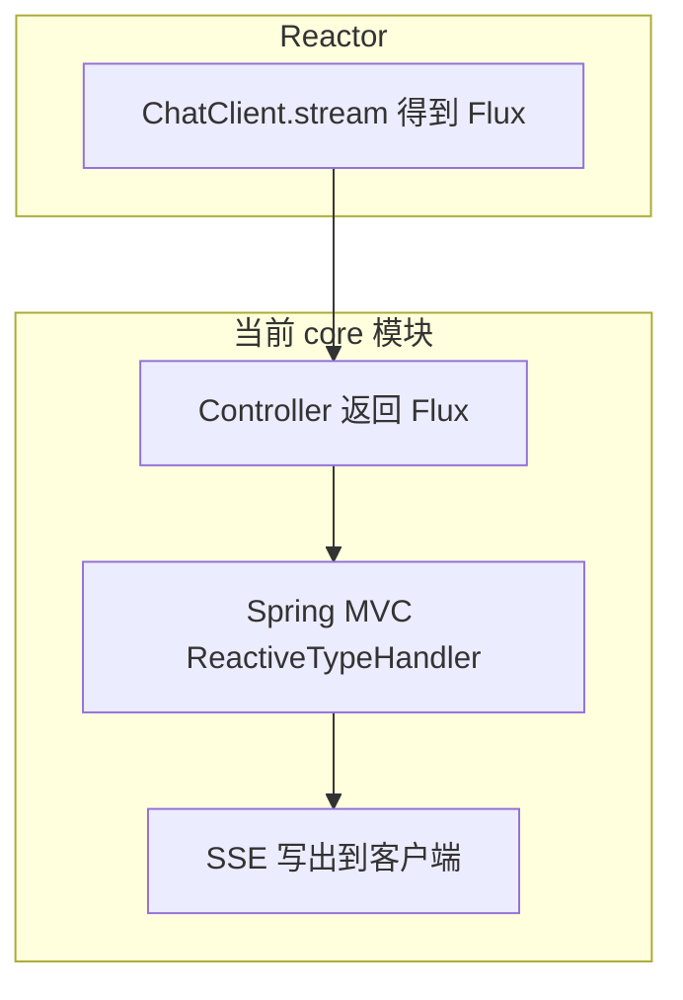

# WebFlux 从 0 到 1（面向 Spring AI）

学 Spring AI 时，流式对话、Token 逐条推送、`ChatClient.stream()` 都会冒出 `Mono` / `Flux`。这不是 Spring AI 另搞的一套 API，而是 **Reactor**（WebFlux 的响应式内核）。本文按「阻塞直觉 → 响应式模型 → 操作符 → HTTP 流式 → 对照本仓库代码」写，读完应能看懂并改 `POST /chat/stream`。

---

## 1. 先记住三句话

1. **WebFlux 是 Spring 的响应式 Web 栈**；底层数据流库是 **Project Reactor**。
2. 你在 Spring AI 里真正天天碰到的，是 Reactor 的两个类型：`Mono<T>`（0 或 1 个元素）和 `Flux<T>`（0 到 N 个元素）。
3. 响应式流是 **「描述接下来怎么做」的流水线**。大多数情况下，**没有人订阅，流水线就不会跑**。

Spring AI 的对应关系：

| 需求 | Spring AI | Reactor 类型 |
|---|---|---|
| 一次拿完整回答 | `chatClient.prompt().user(msg).call().content()` | 阻塞拿到 `String`（内部可能仍是响应式，但对调用方是同步） |
| 边生成边推送 token | `chatClient.prompt().user(msg).stream().content()` | `Flux<String>` |

本仓库已经在用第二种：

```java
// ChatServiceImpl#stream
return chatClient.prompt()
        .user(requireMessage(message))
        .stream()
        .content(); // Flux<String>
```

Controller 把它直接返回给 HTTP：

```java
@PostMapping(value = "/stream", produces = MediaType.TEXT_EVENT_STREAM_VALUE)
public Flux<String> stream(@RequestBody ChatMessageRequest request) {
    return chatService.stream(request.message());
}
```

后面所有概念，都是为了把这两段代码读透。

---

## 2. 为什么会需要 WebFlux

传统 Spring MVC 处理一次请求的典型路径：

```
请求进来 → 占用一个 Servlet 线程 → 调 Ollama / 调数据库（线程卡住等） → 拿到结果 → 写回响应 → 释放线程
```

大模型生成很慢，可能几十秒，还希望 **生成一个 token 就推给前端一个 token**。如果仍用「等全部完成再返回」：

- 用户要干等整段回答结束
- 一个请求长时间占着线程
- 接口形态也表达不了「一串陆续到来的数据」

响应式要解决的是：**数据按时间陆续到达，用订阅关系传递，而不是用返回值一次性端上来。**



这和 ChatGPT 网页「一个字一个字往外蹦」是同一类体验。Spring AI 的 stream API 就是把模型输出封装成 `Flux`。

---

## 3. 换脑子：命令式 vs 响应式

### 3.1 命令式（你已经熟的写法）

```java
String answer = chatService.chat("你好");
System.out.println(answer);
```

含义：调用 → **当前线程堵住** → 有结果了才继续。

### 3.2 响应式

```java
Flux<String> tokens = chatService.stream("你好");
tokens.subscribe(token -> System.out.println(token));
```

含义：先拿到一条 **管道**（还没真正问模型），`subscribe` 之后才开始流动。每个 token 到来时回调一次。

| | 命令式 | 响应式 |
|---|---|---|
| 返回值 | 数据本身 | 数据的生产者（管道） |
| 等待方式 | 线程阻塞 | 事件回调（onNext / onError / onComplete） |
| 多次结果 | `List<T>`（已经全部在内存里） | `Flux<T>`（按时间一个一个来） |
| 适合 | CRUD、一次拿完 | 流式 LLM、SSE、无限或长流水 |

**直觉对照：** `List<String>` 是已经装好的一桶水；`Flux<String>` 是还在流的水管。你接上水管（订阅）才会出水。

---

## 4. 三个角色：Publisher、Subscriber、Subscription

这是 Reactive Streams 规范里的三个接口，Reactor 都实现了。



- **Publisher**：会往外推数据的人。`Flux`、`Mono` 都是 Publisher。
- **Subscriber**：收数据的人。HTTP 层、`subscribe(...)`、`block()` 都算某种订阅者。
- **Subscription**：两者之间的「合同」。订阅者通过它说「我还能再收几个」（背压），也可以 `cancel()` 取消。

Subscriber 只会收到这几种信号：

| 信号 | 含义 | 次数 |
|---|---|---|
| `onSubscribe` | 订阅成功，拿到 Subscription | 1 次 |
| `onNext(T)` | 来了一个元素 | 0~N 次 |
| `onError(Throwable)` | 失败，流结束 | 最多 1 次，之后不会再有数据 |
| `onComplete()` | 正常结束 | 最多 1 次，和 onError 互斥 |

LLM 流式输出可以想象成：

```
onSubscribe
onNext("你")
onNext("好")
onNext("，")
onNext("世界")
onComplete
```

模型超时或断连则是 `onError`。

---

## 5. Mono 和 Flux

都在包 `reactor.core.publisher` 里。

### 5.1 Mono：0 或 1 个元素

适合「一次请求、一个结果」：查用户、调一次非流式 HTTP、最终汇总成一句话。

```java
Mono<String> mono = Mono.just("hello");
Mono<String> empty = Mono.empty();          // 完成但没有元素
Mono<String> error = Mono.error(new IllegalStateException("boom"));
```

常见创建方式：

```java
Mono.just(value);                 // 已有值
Mono.justOrEmpty(optional);       // Optional 空则 empty
Mono.fromCallable(() -> 读文件()); // 订阅时才执行（延迟）
Mono.fromFuture(completableFuture);
Mono.delay(Duration.ofSeconds(1)); // 1 秒后发出 0
```

### 5.2 Flux：0 到 N 个元素

适合 token 流、日志流、消息流。

```java
Flux<String> flux = Flux.just("你", "好", "世界");
Flux<Integer> range = Flux.range(1, 5);          // 1..5
Flux<Long> ticks = Flux.interval(Duration.ofMillis(200)); // 无限，每 200ms 一个
```

Spring AI：

```java
Flux<String> tokens = chatClient.prompt()
        .user("用一句话介绍 Reactor")
        .stream()
        .content();
```

每个 `onNext` 通常是一小段文本（不一定严格一个字，取决于模型分词和实现）。

### 5.3 互相转换

```java
Mono<String> one = Flux.just("a", "b", "c").next();      // 只要第一个
Mono<List<String>> all = Flux.just("a", "b").collectList(); // 收齐变成 List
Flux<String> fromMono = Mono.just("a").flux();
Flux<String> concat = mono1.concatWith(mono2);           // 两个 Mono 拼成 Flux
```

学 Spring AI 时最常用的转换：调试时把流式结果收成一句完整话：

```java
String full = chatService.stream("你好")
        .collect(Collectors.joining())  // 这是 Java Stream，不是 Reactor
        ;

// 正确的 Reactor 写法：
String full2 = chatService.stream("你好")
        .reduce("", String::concat)
        .block();   // 仅调试 / 测试里 block，Web 请求线程里不要随便 block
```

---

## 6. 冷流：不订阅就不执行

这是第一道坎。

```java
Flux<String> flux = Flux.defer(() -> {
    System.out.println("开始问模型");
    return chatClient.prompt().user("hi").stream().content();
});

// 走到这里，上面的「开始问模型」还不会打印
// 因为还没有订阅
```

谁会触发订阅？

| 写法 | 会不会真正跑 |
|---|---|
| `return flux;` 给 Spring MVC / WebFlux Controller | 会。框架当订阅者，把 onNext 写成 HTTP |
| `flux.subscribe(...)` | 会 |
| `flux.block()` / `blockFirst()` / `blockLast()` | 会，而且当前线程等待结束 |
| `flux.publish()` 之后不 `connect()` | **热源建好了，但没人连，数据不会按你以为的方式走** |
| 只是把 Flux 赋值给变量 | 不会 |

所以 Controller **直接 `return Flux`** 是对的：Spring 会订阅。  
你在方法里自己 `subscribe()` 再 return 另一个东西，往往会 **订两次** 或把数据订走，HTTP 层收到空流。

**规则：Web 层把 Flux/Mono 当作返回值交出去，不要在业务里提前 subscribe。**

---

## 7. 必会操作符（够用应付 Spring AI）

操作符不改变原 Flux，而是 **返回一条新管道**。要链式写：

```java
Flux<String> result = source
        .filter(...)
        .map(...)
        .doOnNext(...);
```

### 7.1 同步一对一：`map`

```java
Flux<String> upper = Flux.just("a", "b").map(String::toUpperCase);
// A, B
```

给每个 token 加上前缀：

```java
chatService.stream(msg).map(token -> "data:" + token);
```

### 7.2 一对多 / 异步：`flatMap`、`concatMap`

`map` 的函数如果返回 `Mono`/`Flux`，你会得到 `Flux<Flux<T>>`，这通常不是你想要的。要「摊平」用 `flatMap`：

```java
Flux<String> names = Flux.just("u1", "u2");
Flux<User> users = names.flatMap(id -> findUser(id)); // findUser 返回 Mono<User>
```

区别：

| 操作符 | 行为 |
|---|---|
| `flatMap` | 多个内部流可能 **并发交错** |
| `concatMap` | **一个接一个**，保序 |
| `switchMap` | 来了新元素就取消上一个内部流（搜索联想常用） |

流式对话一般已经是一条 `Flux<String>`，多数时候 `map` 就够。只有「每个 token 还要再调一次异步接口」才需要 `flatMap`。

### 7.3 过滤、截取

```java
flux.filter(s -> !s.isBlank());
flux.take(10);                 // 只要前 10 个
flux.takeUntil(s -> s.contains("END"));
flux.skip(1);
```

### 7.4 旁路观察（不改变数据）：`doOnXxx`

调试神器：

```java
chatService.stream(msg)
        .doOnSubscribe(sub -> log.info("开始流式输出"))
        .doOnNext(token -> log.debug("token={}", token))
        .doOnError(e -> log.error("模型失败", e))
        .doOnComplete(() -> log.info("结束"))
        .doOnCancel(() -> log.info("客户端断开，取消订阅"));
```

前端关掉 SSE 时，Spring 会取消订阅，`doOnCancel` 能看到。这对「别让模型在客户端走了之后还继续生成」很重要。

### 7.5 合并多条流

```java
Flux.merge(fluxA, fluxB);       // 谁先到先发出（交错）
Flux.concat(fluxA, fluxB);      // A 完了才 B
Flux.zip(fluxA, fluxB, (a, b) -> a + b); // 成对组合
```

Spring AI 里较少用，但要知道 `merge` 不保序、`concat` 保序。

### 7.6 变成「一个最终值」

```java
Mono<String> joined = tokens.reduce("", String::concat);
Mono<List<String>> list = tokens.collectList();
Mono<Void> done = tokens.then();          // 忽略元素，只关心完成
```

`then()` 适合「流结束后再做一件事」。

---

## 8. 错误处理

流一旦 `onError`，默认直接失败给订阅者。Web 层就会变成 500 或 SSE 中断。

```java
flux
    .onErrorReturn("（生成失败，请重试）")           // 失败时发一个兜底元素然后完成
    .onErrorResume(e -> Flux.just("降级回答"));     // 失败时换一条流
```

按异常类型：

```java
flux.onErrorResume(TimeoutException.class, e -> Flux.just("模型超时"));
```

超时本身：

```java
chatService.stream(msg)
        .timeout(Duration.ofSeconds(60));
```

注意：`try/catch` **包不住** 已经返回的 `Flux` 里的异步错误。错误发生在订阅之后、别的线程上。要用操作符处理，而不是：

```java
try {
    return chatService.stream(msg); // 这里只是在组装管道，还没执行
} catch (Exception e) {
    // 模型失败进不来这里
}
```

参数校验这种 **组装管道之前** 的同步错误，用 `ResponseStatusException` 仍然合理，本仓库就是这样做的。

---

## 9. 背压（Backpressure）

订阅者可以告诉发布者：「我一次只要 N 个」。这就是背压。

```java
flux.subscribe(new BaseSubscriber<>() {
    @Override
    protected void hookOnSubscribe(Subscription subscription) {
        request(1); // 先只要 1 个
    }

    @Override
    protected void hookOnNext(String value) {
        process(value);
        request(1); // 处理完再要下一个
    }
});
```

日常写 Spring AI **几乎不用手写 request**。`Flux` 默认是请求 `Long.MAX_VALUE`（要多少有多少）。背压在「消费者很慢、生产者很快」时才关键，例如磁盘写入跟不上 token 速度。

LLM 场景更常见的是 **反面：生产者慢（模型一个字一个字吐），消费者快（网络/前端）**，所以背压很少成为你的第一痛点。先知道有这回事即可。

---

## 10. 线程：`subscribeOn` 和 `publishOn`

Reactor 默认很多操作在 **订阅发生的那个线程** 上跑。Web 里通常是 Tomcat / Netty 的事件线程。

```java
flux.subscribeOn(Schedulers.boundedElastic()); // 决定「源头」在哪 generate
flux.publishOn(Schedulers.parallel());         // 决定「下游操作符」在哪执行
```

| API | 作用 |
|---|---|
| `subscribeOn` | 影响整条链的订阅/源头执行线程，一般放一次就够 |
| `publishOn` | 从它之后的操作换线程 |

`Schedulers.boundedElastic()`：适合 **阻塞 IO**（JDBC、阻塞 HTTP、`Thread.sleep`）。  
`Schedulers.parallel()`：适合 CPU 计算。  
`Schedulers.immediate()`：当前线程。

**铁律：不要在 Netty/事件线程里调用阻塞 API。**  
例如在 `map` 里 `restTemplate.getForObject(...)` 或 `Thread.sleep`。若必须阻塞，先 `publishOn(boundedElastic())`，或一开始就不要把那段逻辑放进响应式链。

Spring AI 的 `stream()` 已经把模型的异步 IO 包好了，入门阶段 **不必自己切线程**。等你真的在 `Flux` 里调了 JDBC，再加 Scheduler。

---

## 11. 热流、`publish()`，以及为什么它不能当接口返回值

这是本仓库旧代码踩过的坑。

```java
// 错误示范（旧写法）
return ollamaChatModel.stream(prompt).publish();
```

### 11.1 冷流 vs 热流

| | 冷流（Cold） | 热流（Hot） |
|---|---|---|
| 何时开始 | 每次 subscribe 才开始 | 不管有没有人听，都可能在推 |
| 订阅者关系 | 每个订阅者一份独立数据 | 大家共享同一份正在发生的数据 |
| 例子 | `Flux.just`、`stream().content()` | `Flux.interval` 在 `publish().connect()` 之后、广播 |

`publish()` 把冷流变成 `ConnectableFlux`（可连接的热源）：

- **还没 `connect()` / `autoConnect()`**：没有真正向源头要数据
- **返回类型是 `ConnectableFlux`**，不是给 HTTP 用的普通 `Flux`
- Spring 即便订阅了它，语义也和「这条请求专属的 token 流」对不上：热流是广播模型，HTTP 每个请求需要的是 **冷流（一次订阅 = 一次独立的模型调用）**

### 11.2 正确做法

把 **冷的** `Flux<String>` 直接返回：

```java
return chatClient.prompt().user(message).stream().content();
```

每个 HTTP 请求订阅一次 → 触发一次模型流式调用 → 该客户端断开则 cancel。这正是冷流该有的行为。

只有「多个订阅者要共享同一场直播」才用 `publish()`。Chat 接口不是直播，是一对一会话。

---

## 12. Spring MVC 返回 Flux ≠ 已经换成 WebFlux 应用

名字很容易混：

| 概念 | 是什么 |
|---|---|
| Reactor | `Mono`/`Flux` 库，谁都能用 |
| Spring WebFlux | 基于 Netty（默认）的 **响应式 Web 框架**，`spring-boot-starter-webflux` |
| Spring MVC | 基于 Servlet 的 Web 框架，`spring-boot-starter-web` |
| SSE | HTTP 响应模式：`Content-Type: text/event-stream`，一条连接持续推 event |

本仓库 `core` 目前用的是 **`spring-boot-starter-web`（MVC）**。classpath 上有 Reactor 时，MVC 仍然可以：

- 方法返回 `Flux<T>`
- `produces = TEXT_EVENT_STREAM_VALUE`
- 由 `ReactiveTypeHandler` 订阅 Flux，写成 SSE

所以：**你在 MVC 里返回 `Flux`，用的是 Reactor + SSE，还不是一个 WebFlux 服务器。**

什么时候才需要真正上 WebFlux？

- 要 `WebClient` 的非阻塞调用链贯穿全程
- 要 `ServerRequest` / `RouterFunction` 函数式端点
- 要避免 Servlet 线程模型，用 Netty 扛大量长连接

学 Spring AI 流式输出，**先掌握 Flux + SSE 就够**。不必一上来把项目改成 WebFlux。



---

## 13. SSE：流式对话的 HTTP 协议

SSE（Server-Sent Events）是浏览器原生支持的 **单向服务器推送**。

- 客户端：`EventSource` 或 fetch 读 stream
- 服务端：`Content-Type: text/event-stream`
- 报文形态：

```
data: 你

data: 好

data: 世界

```

每个 `data:` 行对应 Flux 的一次 `onNext`（框架会帮你编码）。流完成则连接结束。

本仓库接口：

```
POST /springAi/chat/stream
Content-Type: application/json
Accept: text/event-stream

{"message":"你好"}
```

本地可用：

```bash
curl -N -X POST 'http://localhost:8080/springAi/chat/stream' \
  -H 'Content-Type: application/json' \
  -H 'Accept: text/event-stream' \
  -d '{"message":"用一句话介绍 Flux"}'
```

`-N` 关闭缓冲，才能马上看到 token。

和 WebSocket 的区别（够用版）：

| | SSE | WebSocket |
|---|---|---|
| 方向 | 服务器 → 客户端 | 双工 |
| 协议 | 就是 HTTP | 单独升级协议 |
| Spring AI 流式聊天 | 非常合适 | 也能做，更重 |
| 浏览器 | `EventSource` | `WebSocket` |

Chat 生成不需要客户端中途狂发二进制帧，SSE 足够。

---

## 14. 对照本仓库：同步 vs 流式

`ChatService`：

```java
String chat(String message);     // 等整句
Flux<String> stream(String message); // token 流
```

| | `/chat/message` | `/chat/stream` |
|---|---|---|
| Spring AI | `.call().content()` | `.stream().content()` |
| 返回 | `ChatMessageResponse` | `Flux<String>` |
| HTTP | 普通 JSON，一次 body | SSE，多次 data |
| 线程 | 调用期间堵住工作线程直到模型说完 | 有 token 就推，不断开连接 |
| 前端体验 | 转圈等到全部结束 | 打字机效果 |

`call()` 对调用方是同步 API，内部实现不必关心。`stream()` 把响应式暴露出来，所以 Controller 必须会处理 `Flux`。

---

## 15. Spring AI 里还会见到的写法

### 15.1 流式拿完整 ChatResponse

```java
Flux<ChatResponse> responses = chatClient.prompt()
        .user(msg)
        .stream()
        .chatResponse();
```

比 `.content()` 信息多（finishReason、metadata）。入门先用 `.content()`。

### 15.2 把 Flux 接到 WebClient

以后用 WebFlux 的 `WebClient` 调别的流式接口：

```java
WebClient.create("http://localhost:8080")
        .post()
        .uri("/springAi/chat/stream")
        .contentType(MediaType.APPLICATION_JSON)
        .accept(MediaType.TEXT_EVENT_STREAM)
        .bodyValue(new ChatMessageRequest("你好"))
        .retrieve()
        .bodyToFlux(String.class)
        .doOnNext(System.out::println)
        .blockLast(); // 命令行小工具可以 blockLast；服务端请继续往外 return
```

`WebClient` 是 WebFlux 栈的 HTTP 客户端，即使你的服务端仍是 MVC，也可以单独用它。

### 15.3 `block()` 只用在边界

| 可以 block | 不要 block |
|---|---|
| `main`、单元测试、CommandLineRunner | Controller / WebFlux 事件线程 |
| 明确的同步门面（你已经提供了 `chat()`） | 已经在 `stream()` 管道中间 |

`chat()` 这种同步方法，本质就是在门面里把响应式结果挡住、等齐。这是有意识的 API 设计，不是在响应式链中间随手 `block()`。

---

## 16. 最小可运行实验（不改业务代码也能练）

在任意 `main` 或测试里：

```java
Flux.just("学", "习", "Flux")
        .delayElements(Duration.ofMillis(300))
        .doOnNext(s -> System.out.println(Thread.currentThread().getName() + " -> " + s))
        .blockLast();
```

观察：三个元素隔 300ms 出现，这就是「随时间展开的序列」。

再试取消：

```java
Disposable d = Flux.interval(Duration.ofMillis(200))
        .doOnNext(i -> System.out.println(i))
        .doOnCancel(() -> System.out.println("cancelled"))
        .subscribe();

Thread.sleep(1000);
d.dispose(); // 等价于取消订阅
```

HTTP 客户端断开 SSE，框架做的就是类似 `dispose()`。

---

## 17. 常见陷阱

1. **把 `Flux` 当 `List` 用**  
   `flux.get(0)` 不存在。要第一个用 `next().block()`，要全部用 `collectList()`。

2. **在返回 Flux 之前自己 subscribe**  
   数据被你的订阅消费掉，HTTP 可能什么都收不到，或模型被调两次。

3. **`publish()` 当返回值**  
   热流 + 未连接，语义和 Chat 一对一请求相反。

4. **用 try/catch 包 Flux 管道**  
   异步错误要用 `onErrorResume` / `doOnError`。

5. **在 `map` 里跑阻塞调用**  
   事件线程被占满，看起来像「WebFlux 还不如 MVC」。

6. **忘记 `produces = TEXT_EVENT_STREAM_VALUE`**  
   有的客户端会按 JSON 一次解析，流式失效或缓冲到结束。

7. **`Flux.interval` 在测试里不结束**  
   无限流必须 `take(...)` 或 `dispose()`，否则 `blockLast()` 永远等。

8. **以为上了 `Flux` 就是 WebFlux 项目**  
   本模块仍是 Servlet MVC。Flux 只是返回类型。

---

## 18. 建议学习顺序

1. 用 `Flux.just` + `subscribe` / `blockLast` 看 onNext、onComplete。  
2. 加上 `map`、`filter`、`doOnNext`。  
3. 理解「不订阅不执行」。  
4. 看懂本仓库 `/chat/message` vs `/chat/stream`。  
5. 用 curl `-N` 看 SSE。  
6. 再学 `onErrorResume`、`doOnCancel`。  
7. 最后才是 Scheduler、WebClient、真正的 `spring-boot-starter-webflux`。

学 Spring AI，到第 6 步就已经能覆盖 90% 的流式对话代码。第 7 步留给「网关式聚合多个模型流」或「全链路非阻塞」再展开。

---

## 19. 和本文相关的仓库代码

| 文件 | 看什么 |
|---|---|
| `spring-ai/core/.../service/ChatService.java` | 同步 `String` 与流式 `Flux<String>` 的接口划分 |
| `spring-ai/core/.../service/impl/ChatServiceImpl.java` | `call()` vs `stream().content()` |
| `spring-ai/core/.../chat/BaseChatController.java` | MVC 返回 Flux + SSE |

读代码时带着三个问题：

1. 这条 `Flux` 的订阅者是谁？（答案：Spring MVC）  
2. 它是冷流还是热流？（答案：冷流，一次请求一次模型调用）  
3. 客户端断开后会发生什么？（答案：取消订阅，上游流应停止）

能回答这三个问题，WebFlux 入门就算过关，可以继续安心学 Spring AI 的 Advisor、Tool 和 RAG。
