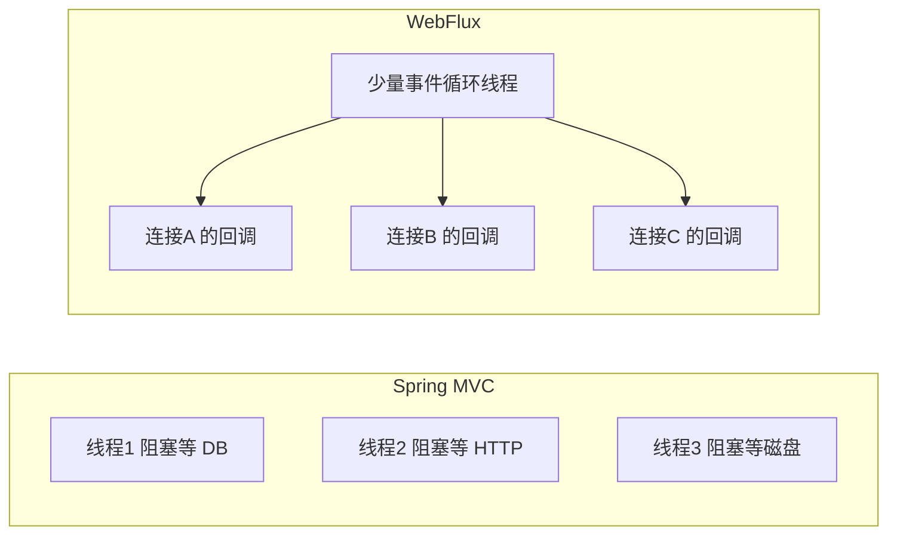

# Spring WebFlux

本文只讲 **Spring WebFlux**：它是什么、能做什么、和 Spring MVC 比有什么取舍。不讲业务场景、不绑某个具体项目。

先纠正一个常见说法：对比对象不是「Spring Boot vs WebFlux」。**Spring Boot 是应用脚手架**，Web 层可以选 **Spring MVC**，也可以选 **Spring WebFlux**。后面说的优缺点，都是 **WebFlux vs MVC**。

---

## 1. WebFlux 是什么

**Spring WebFlux** 是 Spring 5 引入的 **响应式 Web 框架**，用来写非阻塞的 HTTP 服务。

它做三件事：

1. 用 **事件循环** 处理连接，而不是「一个请求占一条线程等到结束」。
2. 用 **Mono / Flux** 描述「现在还没有、稍后才会到来」的结果。
3. 提供一套完整的 Web 能力：路由、参数绑定、过滤器、SSE、WebSocket、HTTP 客户端等。

默认运行在 **Netty** 上（也可以跑在 Servlet 3.1+ 容器上）。引入依赖：

```xml
<dependency>
    <groupId>org.springframework.boot</groupId>
    <artifactId>spring-boot-starter-webflux</artifactId>
</dependency>
```

和 MVC 的对应关系：

| | Spring MVC | Spring WebFlux |
|---|---|---|
| Spring Boot Starter | `spring-boot-starter-web` | `spring-boot-starter-webflux` |
| 默认服务器 | Tomcat（Servlet） | Netty（非 Servlet） |
| 编程风格 | 命令式，方法直接返回数据 | 响应式，方法返回 `Mono` / `Flux` |
| 线程模型 | 一请求一线程，IO 时线程阻塞等待 | 少量事件线程，IO 完成后再回调继续 |

两套栈 **不要同时当服务端用**。classpath 上同时有 `starter-web` 和 `starter-webflux` 时，Spring Boot 默认仍走 MVC。要纯 WebFlux，就只留 `starter-webflux`。

---

## 2. WebFlux 提供了哪些能力

按「你拿它能干什么」列。这是 WebFlux 的功能边界。

### 2.1 非阻塞 HTTP 服务端

接收请求、写出响应，过程中 **不占用工作线程去干等** IO。适合大量并发连接、每个连接等待时间很长的场景（下游慢接口、长轮询、推送）。

### 2.2 注解式 Controller

写法接近 MVC，返回类型换成响应式类型：

```java
@RestController
@RequestMapping("/users")
public class UserController {

    @GetMapping("/{id}")
    public Mono<User> get(@PathVariable String id) {
        return userService.findById(id); // Mono<User>
    }

    @GetMapping
    public Flux<User> list() {
        return userService.findAll();    // Flux<User>
    }
}
```

熟悉的注解都在：`@GetMapping`、`@RequestBody`、`@PathVariable`、`@Valid`、`@ExceptionHandler`。

### 2.3 函数式端点（RouterFunction）

不用注解，用函数组装路由。适合网关、BFF、路由表很大的服务：

```java
@Bean
RouterFunction<ServerResponse> routes(UserHandler handler) {
    return RouterFunctions.route()
            .GET("/users/{id}", handler::get)
            .GET("/users", handler::list)
            .POST("/users", handler::create)
            .build();
}
```

`HandlerFunction` 吃 `ServerRequest`，吐 `Mono<ServerResponse>`。和注解式可以混用。

### 2.4 响应式数据：Mono 和 Flux

这是 WebFlux 的返回值语言，来自 **Project Reactor**。

| 类型 | 含义 | 典型用途 |
|---|---|---|
| `Mono<T>` | 0 或 1 个元素 | 查一条、创建一条、空 404 |
| `Flux<T>` | 0 到 N 个元素 | 列表、无限流、分片推送 |

它们不是「已经算好的数据」，而是 **一条尚未执行的流水线**。有人订阅之后才开始跑。

### 2.5 WebClient（非阻塞 HTTP 客户端）

MVC 里常用的 `RestTemplate` 是阻塞的。WebFlux 配套客户端是 `WebClient`：

```java
Mono<User> user = WebClient.create("http://user-service")
        .get()
        .uri("/users/{id}", id)
        .retrieve()
        .bodyToMono(User.class);
```

也可以 `bodyToFlux` 消费流式响应。即使服务端仍是 MVC，也可以单独用 `WebClient` 做非阻塞调用。

### 2.6 SSE（Server-Sent Events）

一条 HTTP 连接，服务器持续往客户端推文本事件。Controller 返回 `Flux`，并声明：

```java
@GetMapping(value = "/events", produces = MediaType.TEXT_EVENT_STREAM_VALUE)
public Flux<String> events() {
    return Flux.interval(Duration.ofSeconds(1))
            .map(i -> "tick-" + i);
}
```

适合服务端单向推送：进度、日志、通知。浏览器可用 `EventSource`。

### 2.7 WebSocket

全双工长连接。WebFlux 提供 `WebSocketHandler`：

```java
public class EchoHandler implements WebSocketHandler {
    @Override
    public Mono<Void> handle(WebSocketSession session) {
        return session.send(session.receive().map(msg ->
                session.textMessage("echo: " + msg.getPayloadAsText())));
    }
}
```

适合双方都要持续发消息：协同编辑、行情、即时通讯。

### 2.8 过滤器与横切逻辑

- **WebFilter**：类似 Servlet Filter，但是非阻塞的。鉴权、日志、TraceId 往这里放。
- **HandlerInterceptor 没有对等物**。MVC 的拦截器模型建立在阻塞调用链上，WebFlux 用 Filter + `WebFilterChain`。

```java
@Component
public class AccessLogFilter implements WebFilter {
    @Override
    public Mono<Void> filter(ServerWebExchange exchange, WebFilterChain chain) {
        long start = System.currentTimeMillis();
        return chain.filter(exchange)
                .doFinally(sig -> log.info("{} {} {}ms",
                        exchange.getRequest().getMethod(),
                        exchange.getRequest().getPath(),
                        System.currentTimeMillis() - start));
    }
}
```

### 2.9 参数绑定、校验、异常处理

和 MVC 同级的能力都有：

- 路径、Query、Header、Cookie、`@RequestBody` 绑定
- `@Valid` + `LocalValidatorFactoryBean`
- `@ExceptionHandler`、`@ControllerAdvice`
- 函数式端点用 `RequestPredicate`、手动校验

### 2.10 CORS、静态资源、WebSession

- CORS：`@CrossOrigin` 或全局 `CorsWebFilter`
- 静态资源：`spring.webflux.static-path-pattern`
- Session：`WebSession`（不是 Servlet `HttpSession`），可落到 Redis 等

### 2.11 Spring Security 的 WebFlux 版

过滤器链是 `SecurityWebFilterChain`，不是 Servlet 的 `FilterChainProxy`。写法不同，能力对应：认证、授权、CSRF、OAuth2。

### 2.12 测试：WebTestClient

不启真实端口也能测路由和 JSON：

```java
webTestClient.get().uri("/users/1")
        .exchange()
        .expectStatus().isOk()
        .expectBody(User.class);
```

### 2.13 背压（Backpressure）

订阅者可以告诉发布者「我一次只要 N 个」。生产者太快、消费者太慢时，避免把内存撑爆。HTTP 写出跟不上时，WebFlux 会把背压传到上游 `Flux`。

### 2.14 和响应式数据访问拼成全链路

WebFlux **本身不管数据库**。要整条链路都不阻塞，下游也得是响应式的：

| 阻塞（不该在事件线程里直接调） | 非阻塞替代 |
|---|---|
| JDBC / MyBatis / JPA | R2DBC |
| `RestTemplate` | `WebClient` |
| 同步 Redis 客户端 | Lettuce Reactive / Spring Data Redis Reactive |
| 阻塞 Mongo 驱动 | Spring Data Mongo Reactive |

只把 Controller 改成 `Mono`，里面仍 `jdbcTemplate.query`，**等于没换成非阻塞**，还会把 Netty 事件线程堵死。

---

## 3. 核心差异：线程怎么干活

这是理解 WebFlux 的钥匙。功能列表只说明「有什么」，线程模型说明「为什么和 MVC 不一样」。

### 3.1 Spring MVC：线程被 IO 绑住

```
请求进来
  → 从 Tomcat 线程池取出一条线程
  → 这条线程执行 Controller、查库、调 HTTP
  → 等下游返回期间，线程一直占用着
  → 写回响应，线程归还线程池
```

1000 个慢请求 ≈ 1000 条线程在睡。线程贵（栈内存、切换），所以 MVC 靠把线程池开大来扛并发，上限很明显。

### 3.2 WebFlux：线程只干活，不等待

```
请求进来
  → 事件循环线程接手，注册「等 IO」
  → 线程立刻去处理别的连接（不睡）
  → IO 完成，事件循环再回调后续逻辑
  → 写出响应
```



同样 1000 个慢请求，WebFlux 可能只用几十条事件线程。前提是：**回调里不能出现阻塞调用**。一旦在事件线程里 `Thread.sleep`、JDBC、`RestTemplate`，事件循环被卡住，所有连接一起堵。

### 3.3 直观对比

| | MVC | WebFlux |
|---|---|---|
| 并发 1 万长连接 | 需要很大线程池，内存高 | 少量线程即可挂住连接 |
| 一次请求里的 CPU 计算 | 没问题 | 同样没问题，也没优势 |
| 一次请求里的阻塞 IO | 正常用法 | **禁止**在事件线程做 |
| 吞吐上限主要卡在 | 线程数、内存 | 事件循环是否被阻塞、下游是否非阻塞 |

WebFlux 不是「更快的 MVC」。同样做一次简单 CRUD、下游是本地内存，两者延迟差不多。它赢在 **连接数上去之后，线程和内存不再线性膨胀**。

---

## 4. 编程模型：Mono / Flux 怎么用

### 4.1 管道，不是数据

```java
Mono<User> mono = userRepository.findById(id);
```

这行执行完，**数据库还没查**。`mono` 是一张说明书：订阅之后才查。谁会订阅？

- Controller `return mono;` → Spring 当订阅者，结果写成 HTTP
- `mono.subscribe(...)` → 你自己订
- `mono.block()` → 当前线程堵住直到有结果（Web 请求线程里不要用）

规则：**Web 层把 Mono/Flux 当返回值交出去，不要在业务里提前 subscribe。**

### 4.2 常用操作符

操作符返回 **新管道**，链式写：

```java
Mono<UserDto> dto = userRepository.findById(id)
        .filter(User::isActive)
        .map(this::toDto)
        .switchIfEmpty(Mono.error(new NotFoundException(id)));
```

| 操作符 | 作用 |
|---|---|
| `map` | 同步一对一转换 |
| `flatMap` | 转换结果仍是 Mono/Flux 时摊平；内部可并发 |
| `concatMap` | 同 flatMap，但一个接一个、保序 |
| `filter` | 过滤 |
| `zip` / `zipWith` | 多个 Mono 凑齐再往下 |
| `then` | 忽略元素，只关心完成 |
| `doOnNext` / `doOnError` / `doOnCancel` | 旁路日志，不改数据 |
| `onErrorResume` / `onErrorReturn` | 失败降级 |
| `timeout` | 超时 |

`try/catch` 包不住已经返回的 `Mono` 里的异步错误。错误发生在订阅之后，要用 `onErrorResume` 这类操作符。

### 4.3 冷流和热流

| | 冷流 | 热流 |
|---|---|---|
| 何时开始 | 每次 subscribe 才开始 | 不管有没有人听，都可能在推 |
| 订阅者 | 每人一份独立数据 | 共享正在发生的数据 |
| HTTP 接口 | **该用冷流**：一次请求一次独立查询 | 直播、广播才用热流 |

`Flux.just`、`Mono.fromCallable`、一次 HTTP 调用，都是冷流。`publish()` 会变成可连接的热源，一般 **不能直接当接口返回值**。

### 4.4 线程切换

```java
.mono.subscribeOn(Schedulers.boundedElastic())  // 源头在哪个线程跑
     .publishOn(Schedulers.parallel())           // 这之后的操作换线程
```

| Scheduler | 用途 |
|---|---|
| `boundedElastic` | 不得已的阻塞 IO（包一层遗留 JDBC） |
| `parallel` | CPU 计算 |
| `immediate` | 当前线程 |

正确做法是下游也非阻塞。实在要调阻塞库，必须切到 `boundedElastic`，否则事件循环被占满，表现会比 MVC 更差。

---

## 5. 两种写接口的方式

### 5.1 注解式（和 MVC 最像）

适合从 MVC 迁移、团队已经习惯 Controller。返回 `Mono<T>` / `Flux<T>` / `Mono<Void>` / `Mono<ResponseEntity<T>>`。

SSE：

```java
@GetMapping(value = "/stream", produces = MediaType.TEXT_EVENT_STREAM_VALUE)
public Flux<Item> stream() {
    return itemService.stream();
}
```

### 5.2 函数式

适合路由集中声明、按请求动态组装响应。核心类型：

- `RouterFunction`：路由表
- `HandlerFunction`：处理函数
- `ServerRequest` / `ServerResponse`：请求和响应的响应式封装

```java
public Mono<ServerResponse> get(ServerRequest request) {
    String id = request.pathVariable("id");
    return userService.findById(id)
            .flatMap(user -> ServerResponse.ok().bodyValue(user))
            .switchIfEmpty(ServerResponse.notFound().build());
}
```

选型：业务 CRUD 用注解更省事；网关、聚合层、路由特别多时用函数式更清晰。不是必须二选一。

---

## 6. 和 Spring MVC 比：优点、缺点

### 6.1 WebFlux 的优点

1. **高并发连接更省线程和内存**  
   一万条空闲或慢连接，MVC 要庞大线程池；WebFlux 用少量事件线程挂住。

2. **天然适合流式响应**  
   `Flux` + SSE / WebSocket 是一等公民，不用靠异步 Servlet 补丁硬拧。

3. **背压**  
   下游写不出去时，上游可以少生产，降低 OOM 风险。

4. **全链路非阻塞时，线程利用率高**  
   Controller → WebClient → R2DBC 全程不睡线程，同样硬件能排更多等待中的请求。

5. **函数式路由**  
   MVC 也能写一点类似能力，但 WebFlux 把它做成正式模型，组合、嵌套、按条件装配路由更顺。

### 6.2 WebFlux 的缺点

1. **学习成本高**  
   要建立「管道 / 订阅 / 冷热流 / 不要阻塞事件线程」这套心智。同一段业务，代码往往比 MVC 更绕。

2. **阻塞生态接不上**  
   MyBatis、JPA、很多 SDK、文件 API 都是阻塞的。硬接会毁掉事件循环。要么换 R2DBC / 响应式驱动，要么把阻塞调用隔离到弹性线程池——后者等于混用两套模型，复杂度上去，收益下降。

3. **ThreadLocal 基本失效**  
   一次请求会在不同线程的回调里继续。日志 TraceId、简单的上下文传递要用 Reactor Context / `ContextSnapshot`，不能靠 `ThreadLocal`。

4. **调试和排错更难**  
   堆栈是操作符链，断点打在 `map` 里看到的线程不是请求进来的那条。链路追踪也要按响应式方式接。

5. **对 CPU 密集、简单 CRUD 没有优势**  
   计算型和短平快接口，瓶颈在 CPU 或单次查询，不在线程数。这时 WebFlux 只增加心智负担。

6. **人才和库的成熟度不如 MVC**  
   问题更少人踩过；部分中间件只有阻塞客户端。

7. **和 MVC 不能当两套服务端叠在同一个应用里混用**  
   可以在 MVC 应用里用 Reactor 类型做返回值（见第 8 节），但那不是 WebFlux 服务器。真正的运行时只能二选一。

### 6.3 对照表

| 维度 | Spring MVC | Spring WebFlux |
|---|---|---|
| 开发效率 | 高，心智负担低 | 低，要熟悉 Reactor |
| 简单 CRUD | 更合适 | 能写，但没收益 |
| 高并发长连接 | 线程和内存先顶不住 | 强项 |
| 流式推送 | 能做，不是第一公民 | 第一公民 |
| JDBC / MyBatis | 原生就合适 | 别在事件线程用 |
| RestTemplate | 常用 | 改用 WebClient |
| 事务 | Spring 声明式事务成熟 | 响应式事务模型不同，R2DBC 事务能力也更窄 |
| 监控排障 | 线程 dump 直观 | 需要熟悉 Reactor / Netty |
| 团队门槛 | 低 | 高 |

---

## 7. 什么时候用 WebFlux，什么时候不要

**值得用：**

- 大量长连接：SSE、WebSocket、长轮询
- 网关 / BFF：一个请求要扇出调很多下游 HTTP，且都是 IO 等待
- 下游已经是响应式（R2DBC、Reactive Redis、WebClient），希望整条链不阻塞
- 连接数是容量瓶颈，而不是单次请求的 CPU

**不要为了用而用：**

- 普通后台管理、CRUD、报表
- 核心路径必须走 MyBatis / JPA / 阻塞 SDK，短期内不打算换
- 团队没有响应式编程经验，也没有高并发长连接的真实压力
- 把「返回类型改成 Mono」当成性能优化——底下还是阻塞 IO 的话，只会更慢

经验法则：**先有「连接数 / 等待时间」的压力，再上 WebFlux；没有压力就用 MVC。**

---

## 8. 几个容易混的概念

### 8.1 Spring Boot ≠ Spring MVC ≠ WebFlux

- **Spring Boot**：自动配置、起步依赖、内嵌服务器。
- **Spring MVC**：Servlet 栈上的 Web 框架。
- **Spring WebFlux**：响应式栈上的 Web 框架。

说「用 Spring Boot」没有指定 Web 层。要说清楚是 MVC 还是 WebFlux。

### 8.2 在 MVC 里返回 Flux，仍然不是 WebFlux 应用

`spring-boot-starter-web` 的项目，只要 classpath 有 Reactor，Controller 也可以 `return Flux`，并做成 SSE。那是 **MVC + Reactor**，运行时还是 Tomcat 线程池，不是 Netty 事件循环。

| 你做了什么 | 实际用的是 |
|---|---|
| 只加了 Reactor，MVC 返回 `Flux` | Spring MVC + Reactor |
| 依赖换成 `starter-webflux`，服务器是 Netty | Spring WebFlux |
| 只用 `WebClient` | 客户端能力，和服务端是不是 WebFlux 无关 |

### 8.3 Reactor 不是 WebFlux

**Project Reactor** 是 `Mono`/`Flux` 那套库。WebFlux **用** Reactor 做编程模型。命令行程序、消息消费、Spring AI 都可以只用 Reactor，不引入 WebFlux。

### 8.4 异步 Servlet ≠ WebFlux

Servlet 3.1 的 `AsyncContext`、MVC 的 `DeferredResult` / `SseEmitter` 也能异步写出。它们仍活在 Servlet 容器里，没有 Reactor 那套管线、背压和统一的 `WebClient` 模型。WebFlux 是另一条栈，不是 MVC 异步的升级开关。

---

## 9. 建议学习顺序

1. 分清 Boot / MVC / WebFlux / Reactor 四个词。
2. 搞懂 MVC 和 WebFlux 的线程差异（第 3 节）。看完应能回答：为什么不能在 WebFlux 里直接调 JDBC。
3. 用 `Mono.just` / `Flux.range` + `subscribe` / `block` 看 `onNext`、`onError`、`onComplete`。
4. 写一个只有内存数据的 WebFlux Controller：`Mono` 返回一条，`Flux` 返回列表。
5. 加上 `map`、`flatMap`、`switchIfEmpty`、`onErrorResume`。
6. 用 `WebClient` 调一个下游 HTTP，体会非阻塞调用链。
7. 写一个 SSE 接口，用 curl `-N` 看持续输出。
8. 最后才是 `WebFilter`、函数式路由、Scheduler、和 R2DBC 对接。

前 5 步不过关，后面的「性能」和「背压」都会是空话。

---

## 10. 读完应能回答的问题

1. WebFlux 是 Web 框架，不是 Spring Boot 的替代品。
2. 它的功能：非阻塞服务端、注解式和函数式路由、Mono/Flux、WebClient、SSE、WebSocket、WebFilter、校验与异常、WebSession、Security、WebTestClient、背压。
3. 相对 MVC 的核心优势是 **高并发连接下的线程与内存**，以及 **流式 IO**；核心代价是 **编程模型和阻塞生态**。
4. 简单 CRUD、MyBatis 为主的应用，继续用 MVC。
5. 只有服务端换成 `starter-webflux`（通常是 Netty）才叫 WebFlux 应用；MVC 里返回 `Flux` 只是借用了 Reactor。
