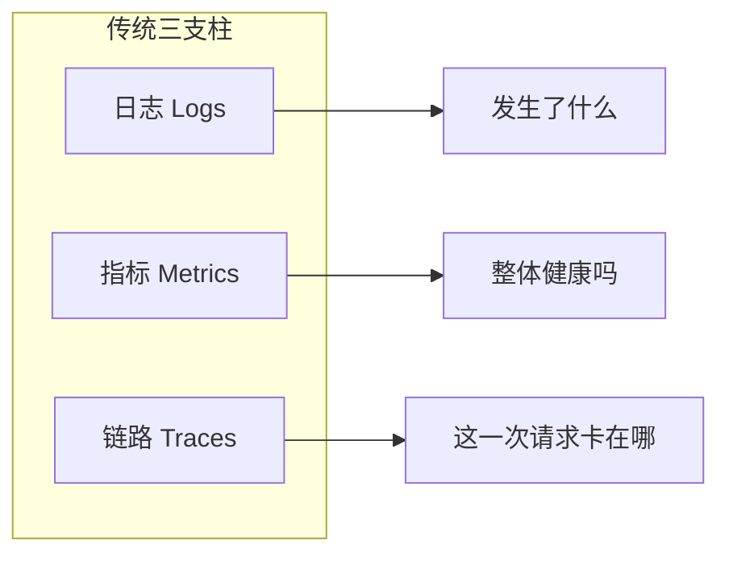
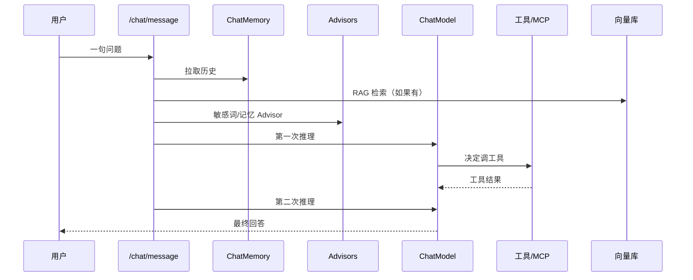
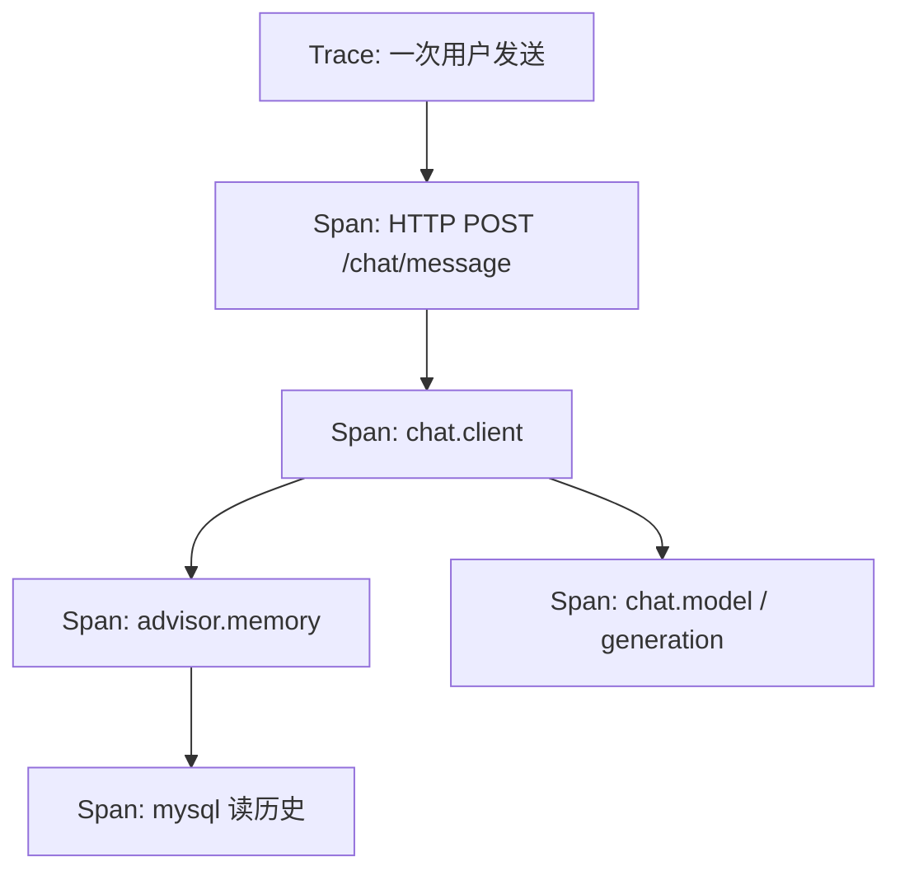
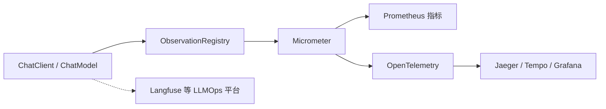
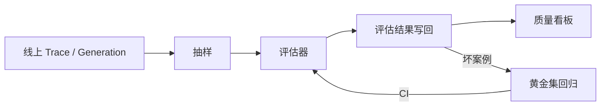
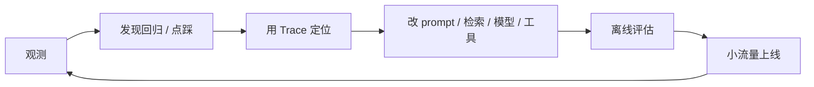

# AI 可观测从 0 到精通（面向 Spring AI）

你现在对「AI 可观测」完全没概念是正常的。传统后端看的是接口慢不慢、有没有 500；大模型应用还要回答另一类问题：**这次回答贵不贵、胡没胡说、检索有没有用上、工具调用有没有跑偏、同一会话前后是否一致。**

本文按「传统可观测 → AI 为什么特殊 → 要采什么 → Spring AI 怎么接 → 质量评估 → 生产与精通」写。读完应能：

1. 用正确术语描述一次对话链路，而不是只会说「打个日志看看」。
2. 看懂本仓库 `ChatClientConfig` 里已经出现的 `ObservationRegistry` 是干什么的。
3. 知道日志、指标、链路、评估各自解决什么问题，以及什么时候该上 Langfuse / OpenTelemetry / Prometheus。
4. 能给自己的 Chat / 流式 / Memory / Advisor / MCP 画出该埋的观测点。

---

## 0. 怎么读这篇

不要指望一次读完就「会做平台」。按阶段读，每阶段只追求一个能力：

| 阶段 | 读哪些节 | 读完你应该能做什么 |
|---|---|---|
| 入门 | 1 ~ 5 | 能说出观测对象清单，解释可观测 ≠ 监控，能数出五类信号 |
| 能看懂链路 | 6 ~ 8 | 能把一次 `/chat/message` 拆成 Trace / Span / Generation |
| 能对上 Spring | 9 ~ 10 | 能指着本仓库代码说出「观测数据从哪冒出来」 |
| 能谈质量 | 11 | 能区分「系统健康」和「回答质量」，知道评测怎么做 |
| 能上生产 | 12 ~ 14 | 能选工具、定 SLO、处理隐私和成本、做持续改进 |
| 查词 / 自测 | 15 ~ 17 | 忘了某个词就回来查 |

文中会同时给出**口语说法**和**应该用的专业词**。以后和别人讨论时，优先用专业词。

---

## 1. 先记住三句话

1. **可观测（Observability）**不是一种产品，而是一种能力：系统出了问题时，你能靠它**已经吐出来的信号**定位原因，而不必先猜再加日志重发。
2. **AI 可观测 = 传统三支柱（日志 / 指标 / 链路） + 模型特有信号（Token、成本、提示词、工具调用、检索、回答质量）。**
3. 大模型调用经常是 **200 OK 但回答是错的**。所以只看 HTTP 成功率和延迟，等于只观测了「管道通不通」，没观测「水能不能喝」。

本仓库已经碰到第二句话的入口：组装 `ChatClient` 时必须把 `ObservationRegistry` 传进去，否则后续接 Micrometer / OpenTelemetry 会断。

```java
// ChatClientConfig#buildChatClient
ChatClient.Builder builder = ChatClient.builder(
        chatModel,
        observationRegistry.getIfUnique(() -> ObservationRegistry.NOOP),
        chatClientObservationConvention.getIfUnique(),
        advisorObservationConvention.getIfUnique(),
        toolCallingAdvisorBuilder.getIfAvailable());
```

`NOOP` 的意思是：现在没有观测注册表就什么都不记，但**调用链形状已经为观测留好了**。后面所有概念，都是为了把这句话读透。

---

## 2. 先钉死：AI 可观测到底在观测什么

先把两个容易混的东西拆开：

| | 观测手段（怎么采、存在哪） | 观测对象（采什么内容） |
|---|---|---|
| 问的是 | 用日志、指标、链路、评估记录中的哪一种来承载 | 一次 AI 请求里，哪些事实必须被记下 |
| 例子 | Prometheus 里一条直方图；Jaeger 里一棵 Span 树 | 模型名、输入 Token、prompt 文本、工具参数 |

**日志 / 指标 / 链路不是观测内容，只是三种存放方式。** AI 可观测的内容，是下面这张清单。缺哪一项，对应的问题就只能靠猜。

### 2.1 一次模型调用上，必须能看见的内容

把 `chatClient.prompt().user(message).call()` 当成最小观测单元。专业上这一次叫 **Generation（一次生成 / 一次补全）**。

```text
用户说了一句话
        │
        ▼
┌───────────────────────────────────────────────┐
│  观测对象 = 这次生成的「入参 + 出参 + 开销 + 身份」 │
│                                               │
│  入参：谁、用哪个模型、什么参数、喂了什么上下文      │
│  出参：生成了什么、为何结束、有没有报错            │
│  开销：花了多久、多少 Token、多少钱               │
│  身份：好把这一次和同一会话、同一用户、同一版提示词串起来 │
└───────────────────────────────────────────────┘
```

逐项对照：

| 类别 | 观测内容（记什么） | 不记的话你会怎样 |
|---|---|---|
| 身份 | `traceId`、`spanId`、`conversationId`、`userId`、`messageId`、`promptVersion` | 无法把多轮对话、日志、指标对上；无法证明「这次差是因为刚改了提示词」 |
| 模型与参数 | 供应商、模型名（如 `qwen2.5:3b-instruct`）、温度、topK、是否流式 | 无法对比「换模型前后」或「温度改了之后」 |
| 输入文本 | 系统提示、历史记忆、检索片段、用户原话（可脱敏） | 无法回放，无法解释模型当时到底看见了什么 |
| 输出文本 | 模型完整回复；流式还要能拼回全文 | 无法做质量复盘，点踩后看不到当时答了啥 |
| 结束状态 | `finish_reason`（说完 / 超长度 / 被安全过滤 / 要调工具）、错误类型 | 200 OK 和「话没说完」「被拦了」会混在一起 |
| 用量 | 输入 Token、输出 Token、缓存命中 Token | 不知道贵在输入膨胀还是模型爱啰嗦 |
| 成本 | 按单价算出的这次费用（本地 Ollama 可换成 GPU 时间） | 账单爆了无法归因到功能 / 用户 / 提示词 |
| 时间 | 开始时间、总耗时；流式还要 **TTFT**（首字出现时间）、生成速度 | 只知道「慢」，不知道用户是等第一个字等了 8 秒，还是后面写得慢 |

这八类是 **所有 AI 可观测的底座**。后面 RAG、工具、Agent，都是在这次 Generation 前后再挂内容，不是另一套宇宙。

### 2.2 一次用户发送，往往不止一次模型调用

用户点一次发送，观测对象会沿链路变长。每多一个步骤，就要多记一类内容：

| 步骤 | 额外要观测的内容 |
|---|---|
| Chat Memory | 读了多少条历史、注入了多少 Token、读写是否失败、耗时 |
| RAG 检索 | 查询文本、向量化耗时、召回了哪些文档、每条分数、是否空检索 |
| Advisor（如敏感词） | 拦截发生在输入还是输出、命中了什么规则、请求被放行还是阻断 |
| 工具 / MCP | 工具名、参数、返回、成功失败、耗时；模型因此又发起的下一次 Generation |
| Agent / Graph | 走到了哪个节点、循环了几次、是正常结束还是打到步数上限 |
| 流式 | 首 Token 时间、是否被客户端取消、中途有没有断 |

对应到本仓库的一条同步请求，观测对象长这样：

```text
POST /chat/message 这一次
├─ HTTP：状态码、接口耗时
├─ Memory Advisor：从 MySQL 取出的历史条数 / Token
├─ SensitiveWordsAdvisor：是否拦截
└─ Generation（Ollama）
     ├─ 入参：model、temperature、messages
     ├─ 出参：completion、finish_reason
     └─ 开销：latency、input_tokens、output_tokens
```

### 2.3 模型自己不会告诉你的内容（质量 / 安全 / 业务）

上面 2.1、2.2 大多能从 **一次调用的请求和响应里直接读出来**（Token、耗时、文本、工具参数）。下面三类 **不会出现在 `ChatResponse` 里**，但仍然是 AI 可观测的内容——要用评估器、规则或用户行为另外采：

| 类别 | 观测内容 | 典型来源 |
|---|---|---|
| 质量 | 是否答到点子上、是否幻觉、格式是否合格、RAG 是否忠于资料、Agent 任务是否完成 | 规则校验、LLM-as-Judge、黄金集、人工抽检 |
| 安全 | 提示注入、越狱、PII 泄露、有毒内容、敏感词命中 | 安全网关、Advisor、分类器 |
| 业务 | 点赞/点踩、重新生成、复制、采纳、转人工 | 产品埋点 |

所以完整说法是：

> **AI 可观测 = 观测一次生成的入参/出参/开销/身份 + 观测它前后的记忆/检索/工具/Agent 步骤 + 观测这次结果好不好、安不安全、对业务有没有用。**

第 5 节会把这三层收成「五类信号」，方便做方案时查漏；第 6 节会讲这些内容在 Trace 上怎么挂。若你只记住一个位置，记住本节这张清单即可。

---

## 3. 可观测到底是什么（手段，不是对象）

### 3.1 先把两个词分开

很多人把「监控」和「可观测」混着用。它们相关，但不是同一个问题。

| | 监控 Monitoring | 可观测 Observability |
|---|---|---|
| 问的问题 | 「我预先关心的指标有没有越线？」 | 「出了未知问题，我能不能从信号里解释原因？」 |
| 典型动作 | CPU > 80% 告警、错误率 > 1% 告警 | 顺着一次请求的 Trace，看到是哪个模型、哪次工具调用、哪段提示词出问题 |
| 预设程度 | 必须先知道要盯什么 | 面对没预设过的故障，仍能追查 |
| 比喻 | 仪表盘上的几个灯 | 行车记录仪 + 黑匣子，事后能回放 |

监控是可观测的子集。AI 场景里更需要可观测，因为故障形态经常是新的：提示词改了一个字、模型供应商抽风、检索召回了错文档、Agent 循环调用工具。

### 3.2 传统三支柱

这是所有可观测讨论的底座，AI 并没有废除它们，只是在上面加层。



**日志（Logs）**：某时某地发生了一件事的记录。适合存「这次用了哪条 prompt、模型返回了什么错误码、敏感词拦截了哪次请求」。缺点是量大、难聚合，「平均慢多少」这种问题不该靠扫日志回答。

**指标（Metrics）**：按时间聚合的数字。例如 QPS、P99 延迟、Token 消耗、费用。适合告警和看趋势。缺点是没有单次请求的故事，你只知道「变慢了」，不知道「哪一次、因为什么」。

**链路（Traces）**：把一次请求经过的所有步骤串成一条因果链。每个步骤叫 **Span（跨度）**，整条请求叫 **Trace（追踪）**。适合回答「这一次对话为什么花了 8 秒」。

三者必须能对上同一个 ID。专业说法是 **关联（Correlation）**：日志里带 `traceId`，指标按相同标签聚合，才能从「仪表盘红了」跳到「那一次具体请求」。

### 3.3 还有两个常被忽略的支柱

现代讨论里还会补两样，AI 场景特别常用：

- **事件（Events）**：比日志更结构化的业务事实。例如「用户点了踩」「触发了敏感词拦截」「Agent 决定调用某个工具」。
- **画像 / 持续剖析（Profiling）**：看 CPU、内存、GC。对推理服务（你自己托管模型）重要；你现在调 Ollama / 云厂商 API 时，优先级低于 Trace 和 Token。

### 3.4 用一次普通 HTTP 把三个词钉死

假设 `POST /springAi/chat/message`：

```
Controller 收到请求
  → ChatServiceImpl.chat()
    → ChatClient.prompt().call()
      → 访问 Ollama
    → 拿到字符串
  → 返回 ChatMessageResponse
```

- 日志：`"chat completed, conversationId=..., latency=1200ms"`
- 指标：`http_server_requests_seconds{uri="/chat/message"}` 的直方图多了一个样本
- 链路：一条 Trace，下面挂着 `http`、`chat.client`、`chat.model` 几个 Span

如果只有日志，你能知道发生过；如果只有指标，你知道变慢了；有了链路，你才知道慢在「Ollama 推理」还是「查 MySQL 记忆」还是「Advisor 预处理」。

---

## 4. AI 为什么让可观测变难了

传统服务大体是确定性的：同样入参，同样代码，结果应当一样。大模型应用不是。

### 4.1 输出不确定

同样的用户问题，温度（`temperature`）大于 0 时，两次回答可以不同。本仓库默认 `temperature(1.0)`，意味着**同一条用例不能用「字符串完全相等」当正确标准**。

这直接导致：

- 自动化测试不能只断言 `response.equals(expected)`。
- 「回归」必须引入**评估（Evaluation）**：相关性、事实性、格式是否仍满足。
- 线上问题可能无法稳定复现，必须把当时的 **prompt、参数、模型版本、上下文** 完整记下，才能回放。

### 4.2 成功的定义变了

| 传统 API | AI API |
|---|---|
| HTTP 200 + 业务码正确 ≈ 成功 | HTTP 200 只说明「模型服务通了」 |
| 异常、超时、4xx/5xx ≈ 失败 | 还可能：胡编、拒答、答非所问、泄露隐私、工具乱调 |

所以 AI 可观测必须分成两层：

1. **运行时健康（Operational health）**：能否打到模型、延迟、错误、限流。
2. **生成质量（Generation quality）**：回答是否有用、是否忠实于资料、是否安全。

只做第一层，叫「给 LLM 做了传统监控」。两层都做，才叫 AI 可观测。

### 4.3 成本是一等公民

传统接口成本近似于机器和带宽，通常不按次精确计费。模型按 **Token** 计费（本地 Ollama 是电费和显存，云 API 是真金白银）。

一次「能用」的回答可能极贵：上下文塞了整本手册、Agent 循环调用了 20 次工具、用户把历史 50 轮全带上。没有 Token / 费用观测，你最后只会看到「账单爆了」，却不知道是哪个功能、哪类用户、哪条 prompt。

### 4.4 一次用户动作 ≠ 一次模型调用

用户点一次发送，背后可能是：



传统 APM 若只打一个 HTTP Span，中间那些步骤全是黑盒。AI 可观测的核心工作，就是把这些步骤变成**子 Span**，并且把 prompt、检索文档、工具入参出参、Token 用量挂到对应 Span 上。

### 4.5 提示词是代码，但常常没被当代码管

提示词、系统设定、few-shot 例子、Advisor 注入的记忆，都会改变行为。它们应该有：

- **版本（Prompt version）**
- **发布记录**
- **和线上 Trace 的关联**（这条回答用的是 v12 还是 v13）

没有版本关联，你改了 prompt 后质量变差，无法回答「变差是因为模型更新还是提示词更新」。

### 4.6 流式改变了「结束时间」的含义

本仓库已经有 `POST /chat/stream`，返回 `Flux<String>`。用户感知的快慢主要是：

- **首 Token 时间（TTFT, Time To First Token）**：从发请求到第一个字出现。决定「是不是卡住了」。
- **总时长（Total latency）**：到整段结束。
- **生成速度（TPS / TPOT）**：每秒多少 Token，或每个输出 Token 平均耗时。

只记录「整个 `call()` 结束的耗时」，对流式体验几乎没用。用户已经看了 10 秒动画，你却只知道总共 12 秒。

---

## 5. AI 可观测要看的五类信号

把要采集的东西分成五类。做方案、做埋点、做看板时，都按这五类检查有没有漏。

### 5.1 运行时（Operational）

回答：**系统还能不能用。**

- 请求量、成功率、错误分类（超时、限流 429、内容过滤、模型不可用）
- 延迟：TTFT、总时长、各 Span 耗时
- 饱和度：线程、连接池、Ollama 是否排队、限流剩余额度
- 流式是否中断、客户端是否取消订阅

对应传统 SRE 的 **RED**：Rate（速率）、Errors（错误）、Duration（耗时）。

### 5.2 用量与成本（Usage & Cost）

回答：**谁在花钱，花在哪。**

- 输入 Token、输出 Token、缓存命中 Token（有的云厂商对前缀缓存打折）
- 按模型、按功能、按用户、按会话聚合的费用
- 上下文占用率：实际 Token / 上下文窗口上限
- 重试次数、工具调用次数（每次都可能再吃一轮模型）

专业词：**Token 用量（Token usage）**、**成本归因（Cost attribution）**。

### 5.3 质量（Quality）

回答：**回答得好不好。**

- 相关性（Relevance）：有没有回答用户的问题
- 忠实度 / 事实验证（Faithfulness / Groundedness）：有没有脱离检索资料瞎编
- 完整性、格式依从（是否按 JSON / 指定结构输出）
- 幻觉率（Hallucination rate）
- RAG 的上下文精确率 / 召回率
- Agent 的任务完成率、无用工具调用比例

质量信号往往**不能**只从一次模型响应里直接读出来，需要评估器、规则、或用户反馈。详见第 11 节。

### 5.4 安全与合规（Safety & Compliance）

回答：**有没有害处、有没有违规。**

- 提示注入（Prompt injection）
- 越狱（Jailbreak）
- 敏感信息出站（PII leakage）
- 有毒 / 违法内容
- 本仓库的 `SensitiveWordsAdvisor` 属于这一类的拦截点，拦截次数本身就是重要指标

安全观测有一条铁律：**原始 prompt / 回答里可能有身份证号、病历、密钥。能观测不等于能明文存。**

### 5.5 业务（Product / Business）

回答：**这功能对用户有没有价值。**

- 点赞 / 点踩、重新生成、复制、采纳率
- 会话轮次、留存、任务是否完成（例如「是否生成了合格的采购说明」）
- 人工接管率（做客服时：AI 搞不定转人工的比例）

没有业务反馈，质量评估只能停在实验室；有了点踩，你才能把线上坏案例送回评估集。

---

## 6. 核心数据模型：把一次对话讲清楚

### 6.1 Trace、Span、Generation

用一次本仓库的同步聊天举例：

```java
// ChatServiceImpl#chat
String content = chatClient.prompt()
        .user(requireMessage(message))
        .call()
        .content();
```

推荐的链路形状：



名词对照：

| 专业词 | 含义 | 在这次调用里 |
|---|---|---|
| Trace | 一次端到端请求的整条因果链 | 用户点一次发送 |
| Span | 链上的一个步骤，有开始结束时间、属性、父子关系 | HTTP、ChatClient、Advisor、模型调用 |
| Generation / LLM Span | 特指「对模型的一次补全」 | `chat.model` 那一次，上面挂 prompt、completion、token |
| Observation | Spring Micrometer 对「一次可观测动作」的抽象 | Spring AI 内部用它生成 Span 和 Metrics |
| Attribute / Tag | 挂在 Span 或指标上的键值 | `gen_ai.request.model=qwen2.5:3b-instruct` |

AI 可观测相对传统 APM 的关键增量，就是 **Generation Span**：除了耗时，还要带模型名、参数、Token、有时还带输入输出文本。

### 6.2 会话级 ID，不要只用 TraceId

一次 Trace 只覆盖「这一次 HTTP」。聊天是多轮的，你还需要：

| ID | 作用 | 典型来源 |
|---|---|---|
| `traceId` | 关联这一次请求的日志/指标/链路 | Micrometer Tracing / OTel 自动生成 |
| `spanId` | 当前步骤 | 同上 |
| `conversationId` / `sessionId` | 把多轮对话串成一个会话 | 你的业务，Chat Memory 的 conversationId |
| `userId` | 成本归因、安全审计 | 登录态 |
| `messageId` | 某条用户消息或助手消息 | 业务表主键 |
| `promptVersion` | 用了哪版提示词 | 你自己发版 |

本仓库记忆在 MySQL 里（`MessageMysqlChatMemory` / `ChatMemoryEntity`）。会话 ID 是把「可观测」和「业务数据」接起来的钉子：没有它，你在 Jaeger 里看到一堆孤立 Trace，无法回答「这个用户昨天那通会话整体体验如何」。

### 6.3 OpenTelemetry GenAI 语义约定

行业正在把字段名标准化，避免每家工具各说各话。这套标准叫 **OpenTelemetry Semantic Conventions for Generative AI**。你不需要背全，但要认识这批键，以后看 Grafana / Jaeger / Langfuse 才不懵。

常见属性（名字以官方约定为准，会随版本微调）：

| 属性 | 含义 |
|---|---|
| `gen_ai.operation.name` | `chat` / `text_completion` / `embeddings` / `execute_tool` |
| `gen_ai.provider.name` | `ollama` / `openai` / `anthropic` … |
| `gen_ai.request.model` | `qwen2.5:3b-instruct` |
| `gen_ai.request.temperature` | 温度 |
| `gen_ai.request.max_tokens` | 最大输出 |
| `gen_ai.usage.input_tokens` | 输入 Token |
| `gen_ai.usage.output_tokens` | 输出 Token |
| `gen_ai.response.finish_reason` | `stop` / `length` / `content_filter` / `tool_calls` |
| `gen_ai.conversation.id` | 会话 |
| `gen_ai.tool.name` | 工具名 |

Spring AI 的 Observation 会尽量往这套约定靠。你自定义埋点时，**优先复用这些键名**，不要自己发明 `modelName`、`promptTokens` 各写一套。

### 6.4 一次 Generation 建议挂上的最小字段集

做存储或看板时，至少保证能回答「复盘这一次调用」：

```text
时间、耗时、TTFT（流式）
provider、model、temperature、top_k / top_p
input_tokens、output_tokens、估算费用
finish_reason、error_type
conversation_id、user_id、prompt_version
是否流式、是否触发工具、工具名列表
（可选，且要做脱敏）messages / prompt / completion
```

「最小字段集」的意思是：没有文本你也能做成本和延迟分析；没有 Token 你就只能当普通 HTTP 监控。

---

## 7. 关键指标词典

遇到别人甩缩写时查这里。

### 7.1 延迟类

| 指标 | 专业词 | 怎么理解 | 为什么重要 |
|---|---|---|---|
| 首 Token 时间 | TTFT | 发请求 → 第一个输出 Token | 流式体验的生命线 |
| 每个输出 Token 耗时 | TPOT | 生成阶段平均每个 Token 的时间 | 模型「写字速度」 |
| 每秒 Token 数 | TPS / tok/s | 1 / TPOT | 和供应商 SLA 对比 |
| 端到端耗时 | E2E latency | 用户发起到完整结束 | 含检索、记忆、工具、网络 |
| P50 / P95 / P99 | 分位数 | 50%/95%/99% 的请求快于该值 | 不要只看平均值，平均值会被长尾骗 |

经验：用户对 TTFT 的体感阈值大致在 1～2 秒。总时长 20 秒但 TTFT 0.4 秒，体感往往好过总时长 8 秒却干等 7 秒才出第一个字。

### 7.2 用量与成本类

| 指标 | 含义 |
|---|---|
| Input tokens | 系统提示 + 历史 + 检索片段 + 用户问题 |
| Output tokens | 模型生成的内容（含思维链、工具参数） |
| Total tokens | 两者之和，常用来估算费用 |
| Context utilization | input tokens / 上下文窗口 |
| Cost per request / per user / per feature | 归因后的钱 |
| Cache hit tokens | 命中前缀缓存的 Token，成本更低 |

本仓库用 Ollama 本地模型时，「费用」可以换成 GPU 时间和排队时间，公式不同，但**用量观测仍然必要**：上下文膨胀一样会拖垮延迟。

粗算云费用（概念，具体价以供应商为准）：

```text
cost ≈ input_tokens * input_price + output_tokens * output_price
```

输出通常比输入贵。Agent 多轮、爱说话的模型，费用会在输出侧爆炸。

### 7.3 错误类（不要全叫 error）

把失败分成可行动的类型，告警才有意义：

| 类型 | 例子 | 你该做什么 |
|---|---|---|
| 超时 Timeout | 模型 60s 无响应 | 看供应商 / Ollama 负载 |
| 限流 Rate limit | HTTP 429 | 退避、排队、降级模型 |
| 上下文超窗 Context overflow | 历史太长 | 裁剪记忆、摘要 |
| 内容过滤 Content filter | 安全策略拦截 | 和敏感词、安全策略对齐 |
| 工具失败 Tool error | MCP 超时、参数非法 | 修工具或提示词 |
| 流式中断 Stream abort | 用户关页面 | 不一定是故障，要单独计数 |
| 质量失败 Quality fail | 200 但乱答 | 走评估和人工复核，不要当 5xx |

`finish_reason=length` 往往不是异常，但产品上等于「话没说完」，应单独监控。

### 7.4 RAG / Agent 专用

| 指标 | 含义 |
|---|---|
| Retrieval latency | 检索耗时 |
| Hit rate / 空检索率 | 有没有召回任何文档 |
| Context precision / recall | 召回的文档准不准、全不全 |
| Groundedness | 回答能否在文档里找到依据 |
| Tool call count | 一次用户请求触发了几次工具 |
| Tool success rate | 工具本身成不成功 |
| Loop / retry count | Agent 是否在空转 |
| Task success rate | 最终有没有完成用户任务 |

---

## 8. 三支柱在 AI 里各自干什么（避免用错工具）

### 8.1 指标：看森林

适合：会不会挂、会不会贵、会不会越来越慢。

看板最小集：

1. 请求量 + 错误率（按 error_type）
2. TTFT P95、E2E P95
3. Token / 费用（按 model、按接口）
4. 工具失败率、空检索率（有 RAG/工具时）
5. 点踩率、敏感词拦截率

告警也主要挂在指标上。不要对「某一条回答不好」做实时告警，那是评估和抽检的事。

### 8.2 链路：看一棵树

适合：这一次为什么慢、Agent 为什么乱、是检索差还是模型差。

好的 AI Trace 应该能直接读出故事：

```text
HTTP 1.8s
  ├─ memory.load 40ms
  ├─ retrieve 120ms   (topK=4, empty=false)
  ├─ chat.model 900ms (in=2.1k tok, out=180 tok, TTFT=280ms)
  ├─ tool.weather 200ms
  └─ chat.model 520ms (第二次，带工具结果)
```

如果 Trace 里只有一个 `POST /chat/message 1.8s`，可观测在 AI 意义上等于没做。

### 8.3 日志：看叶子上的字

适合：当时的 prompt 原文、模型原始错误体、脱敏后的输入输出、评估器打分理由。

三条纪律：

1. **结构化**：JSON 字段，不要靠正则从一句话里抠 Token。
2. **必带关联 ID**：`traceId`、`conversationId`。
3. **默认不记全文**：prompt / completion 体积大、含隐私、成本高。需要时再对抽样请求打开，或只存哈希和长度。

Spring AI 里有一组开关，名字会随版本变化，思想不变：`include-input` / `include-output` / `log-prompt` 这类选项**默认应关**，排障时对非生产或对采样流量打开。

### 8.4 评估数据：第四类存储

三支柱不够用时，单独准备「样本 + 分数」存储：

- 这条样本的输入、检索文档、输出
- 人工标签或 LLM Judge 分数
- prompt 版本、模型版本
- 来源：线上抽样 / 回归集 / 点踩回流

这不是传统 APM 的职责，却是 AI 可观测精通阶段的核心。Langfuse、Phoenix、LangSmith 这类产品，本质上是 **Trace 平台 + 评估数据集平台**。

---

## 9. Spring 生态里的观测：从本仓库长出来

这一节把抽象钉到你们正在用的技术上。

### 9.1 Micrometer Observation 是什么

Spring Boot 3 的统一门面叫 **Micrometer Observation**：

- 一次业务动作 `observe` 一下；
- 既生成 **Timer 等指标**，也可生成 **Trace Span**；
- 再通过 **Bridge** 接到 Prometheus、OpenTelemetry、Zipkin、Brave。

你不需要在业务代码里同时打 Metrics 和 Tracing。观测一次，两头导出。

Spring AI 把 ChatClient、ChatModel、Advisor、Tool、Embedding、VectorStore 都接进了这套 API。所以 `ChatClientConfig` 注释里才会写：不经过 `ChatClientBuilderConfigurer` 会丢掉 Observation。

### 9.2 本仓库现在处于哪一层

对照代码事实：

| 能力 | 本仓库现状 |
|---|---|
| Chat / Stream | 有，`ChatServiceImpl` + `BaseChatController` |
| Chat Memory | 有，MySQL |
| Advisor 扩展点 | 有，`SensitiveWordsAdvisor`（还是空实现） |
| 组装时预留 Observation | 有，`ObservationRegistry` + Convention |
| Actuator / Prometheus | `spring-ai-core` 目前未见 `actuator` 依赖 |
| Micrometer Tracing / OTel 导出 | 未接 |
| Token / 费用看板 | 未接 |
| 质量评估 | 未接 |

结论：**观测的「插头」在，电线还没接上。** 这是学习的最佳位置：先理解插头，再决定接 Prometheus 还是 Langfuse。

### 9.3 Spring AI 会自动观测什么

只要 `ObservationRegistry` 不是 NOOP，并且走官方 `ChatClient.Builder` / 自动配置，一次 `chatClient.prompt().call()` 通常会产出多层 Observation（名称以你使用的 Spring AI 版本为准）：

| Observation | 对应步骤 |
|---|---|
| Chat Client | 你调用 `ChatClient` 的这一次 |
| Advisor | 每个 Advisor 的 before/after，包括 Memory、敏感词、RAG Advisor |
| Chat Model | 真正打到 Ollama / OpenAI 的那一次 HTTP |
| Tool calling | 模型决定调工具，以及工具执行 |
| Embedding / Vector Store | 做 RAG 时 |

这也是为什么手动 `new ChatClient` 很容易「看起来能聊，但观测全丢」。本仓库 `buildChatClient` 坚持走 `ChatClientBuilderConfigurer`，就是为了不丢掉自动配置挂上的 Observation 和 Customizer。

### 9.4 和本仓库调用链的对应

同步：

```
POST /chat/message
  BaseChatController.chat
    ChatServiceImpl.chat
      ChatClient.call          → ChatClient Observation
        MessageChatMemoryAdvisor → Advisor Observation + DB
        SensitiveWordsAdvisor    → Advisor Observation
        OllamaChatModel          → Chat Model Observation
```

流式：

```
POST /chat/stream  (text/event-stream)
  ChatServiceImpl.stream
    ChatClient.stream().content()  → 仍然应有 ChatClient / ChatModel Observation
```

流式要注意三点：

1. Observation 的结束时间应是流完成或取消，而不是方法返回 `Flux` 的那一瞬间。返回 `Flux` 只是搭好管道，**订阅后才真正调模型**（见 `docs/WebFlux内容.md`）。
2. TTFT 应在第一个 `onNext` 时打点。
3. 客户端断开（`doOnCancel`）应记为取消，不要一律记成服务端失败。

### 9.5 若要把「电线」接上，概念上长什么样

这不是让你现在改代码，只是让你知道地图：



两条主流接法：

1. **APM 路线**：Spring AI Observation → Micrometer → Prometheus + Tempo/Jaeger。适合已经有 Grafana 的团队，强在延迟和依赖拓扑，弱在 prompt 级调试和评估集。
2. **LLMOps 路线**：SDK / OpenTelemetry 导出到 Langfuse、Phoenix、LangSmith。适合调 prompt、看 Generations、跑评估。强在 AI 语义，弱在和整站微服务拓扑统一（需要 OTel 打通）。

精通做法往往是：**基础设施 Trace 走 OTel，AI 语义平台要么直接收 OTel，要么再接一个 LLMOps。** 不要业务代码里打三套互不相干的埋点。

### 9.6 Convention：名字和字段是可以定制的

`ChatClientObservationConvention`、`AdvisorObservationConvention` 用来改 Span 名称、加业务标签（例如 `feature=采购助手`）。

默认 Convention 不知道你的业务，只能记模型、消息数量等通用字段。`conversationId`、`userId`、`promptVersion` 这类，要么通过 MDC / Observation 的 high cardinality KeyValue 补，要么在 Advisor 里写入。

高基数标签（每个用户一个值这种）不要当 Prometheus 的 label，否则时间序列爆炸。它们适合放在 **Trace 属性** 或 **日志字段**，不适合放在指标。

---

## 10. 按本仓库会碰到的场景拆开看

### 10.1 单次 Chat

观测目标：这次 call 的模型、Token、耗时、finish_reason、错误。

最小故事：

- HTTP Span：接口耗时
- ChatClient Span：框架层
- ChatModel Span：Ollama `qwen2.5:3b-instruct` 真正推理

你要能回答：慢在 Tomcat 还是慢在模型。本地 Ollama 常见情况是模型冷启动或 CPU 推理导致 TTFT 很高。

### 10.2 流式 Stream

除 9.1 外增加：

- TTFT
- 输出 Token 速度
- 取消率
- 是否因为网络缓冲导致「模型已经出字，浏览器却在等」（这个要前后端一起看，不单是模型问题）

### 10.3 Chat Memory

`MessageChatMemoryAdvisor` 会在调用模型前注入历史。观测上要看到：

- 读历史耗时（MySQL）
- 注入了多少条 / 多少 Token
- 是否因历史过长导致上下文膨胀（成本 + 延迟双杀）
- 写回历史是否失败（失败会表现为「模型能答，但下一轮像失忆」）

这类问题用纯 HTTP 监控看不出来，必须有 Advisor Span 或 SQL Trace。

### 10.4 Advisor（含敏感词）

Advisor 是 Spring AI 的拦截器。每个 Advisor 都应该是独立 Span，否则你不知道 200ms 预处理花在哪。

`SensitiveWordsAdvisor` 目前是空实现，但它在可观测设计里的位置已经明确：

- `before`：输入侧拦截 → 指标 `safety.block{direction=input}`
- `after`：输出侧拦截 → `safety.block{direction=output}`
- 被拦截的请求建议记事件，而不是只抛异常（否则和模型故障混在一起）

安全拦截要进 **安全信号**，不要全部记成 5xx。

### 10.5 Tool Calling 与 MCP

本仓库已有 `mcp-client` / `mcp-server`。工具调用是 AI 链路里最容易变黑盒的部分。

一次带工具的 Trace 至少应包含：

```text
chat.model（模型决定调用）
  tool.execute name=xxx
    （若工具内部再调 HTTP / DB，继续挂子 Span）
chat.model（模型读工具结果再生成）
```

要记录的字段：工具名、参数摘要、成功失败、耗时、返回大小。参数和返回同样有隐私问题。

MCP 场景还要跨进程：Client 一次 Chat，Server 上一次工具。两边必须共用 **Trace context 传播**（W3C Trace Context：`traceparent` 头），否则 Grafana 里会裂成两条无关 Trace。这就是「分布式追踪」在 AI 里的具体含义。

### 10.6 RAG（检索增强）

即使本仓库还没接完整 RAG，也要提前建立正确心智：

RAG 质量差有两种完全不同的病，观测必须能切开：

1. **检索病**：该找的文档没找到，或找到了噪声。看 retrieval 指标和召回内容。
2. **生成病**：文档是对的，模型没用或用错。看 groundedness、引用是否出现。

错误做法：只看最终回答，然后判断「RAG 不好」。你无法知道该调 `topK`、换嵌入模型，还是改生成提示词。

正确 Trace：

```text
embed.query
retrieve.vectorstore  (文档 id 列表、分数)
chat.model            (prompt 里是否包含这些文档)
```

### 10.7 Agent / Graph

`ai-alibaba` 下有 graph 模块。Agent 可观测的额外难点是：**控制流本身也是数据**。

除了每次 LLM / Tool Span，还要能看到：

- 当前节点名、状态机/图的边
- 循环次数、是否命中最大步数
- 每次「思考」消耗的 Token 累计
- 最终是成功结束、用户取消，还是模型自己说「我不行了」

精通标志：能把一次 Agent 运行回放成时间线，而不是只存最终字符串。

---

## 11. 质量可观测：评估体系

这是从「会盯延迟」到「会做 AI 系统」的分界线。

### 11.1 评估（Evaluation）是什么

**评估** = 用一套可重复的方法，给模型输出打分或贴标签。

它不是单元测试的替代，而是单元测试在不确定输出下的进化：

| | 传统测试 | AI 评估 |
|---|---|---|
| 断言 | `assertEquals` | 分数 / 通过阈值 / 人工标签 |
| 输入 | 固定 fixture | 数据集（黄金集、对抗集、线上抽样） |
| 何时跑 | CI 每次提交 | CI + 发版 + 线上持续抽检 |

### 11.2 三类评估，不要混

**离线评估（Offline eval）**

用固定数据集跑。适合改 prompt、换模型、改 RAG 参数之后做回归。优点是可重复；缺点是数据集一陈旧就和线上脱节。

**在线评估（Online eval）**

对线上真实流量抽样打分（规则、轻量模型、或异步 LLM Judge）。优点是真实；缺点是滞后、有成本、有隐私风险。

**人工评估（Human eval）**

点赞点踩、抽检标注。优点是最接近产品对错；缺点是贵、慢、标注者之间不一致。它通常是校准自动评估器的标准答案，而不是每天全量靠人看。

### 11.3 常见自动指标（先认脸）

生成任务：

| 指标 | 问的问题 |
|---|---|
| Answer relevance | 答到点子上了吗 |
| Correctness | 和参考答案一致吗（需要黄金答案） |
| Coherence / Fluency | 通不通顺（现在模型一般不太差，优先级常低于事实性） |
| Faithfulness | 有没有说出检索资料里没有的事实 |
| Toxicity / PII | 安不安全 |
| JSON validity / schema | 格式守不守规矩（这个应用规则，不必上 LLM Judge） |

RAG 专用（常被合称 RAGAS 那套思想）：

| 指标 | 问的问题 |
|---|---|
| Context precision | 检索回来的文档里有多少是真有用的 |
| Context recall | 该出现的要点有没有被检索到 |
| Faithfulness | 回答能否被上下文支撑 |
| Answer relevancy | 回答是否针对问题 |

Agent：

- 最终任务成功与否（最重要）
- 多余工具调用、错误工具选择
- 是否遵守「不该调用工具时别调」

能用规则解决的（正则、JSON Schema、包含必填字段）**不要**用大模型去评，又贵又不稳定。LLM Judge 留给「语义上对不对」这种规则写不清的问题。

### 11.4 LLM-as-Judge（用模型评模型）

做法：另一次模型调用，把「题目、回答、评分标准」送给评判模型，输出分数和理由。

必须知道的坑：

1. **位置偏差**：同样两个回答，谁放前面，谁容易赢。
2. **自我偏好**：用同一家模型评自己，分数虚高。
3. **不稳定**：温度、提示词都会改分数。Judge 要用低温度、固定提示词版本。
4. **成本**：对全量线上流量开 Judge，等于再付一倍钱。必须抽样。
5. **仍要校准**：抽一批人工标注，算 Judge 和人的一致性（例如 Cohen's Kappa、相关系数）。Judge 和人都不一致时，不要信任自动看板。

### 11.5 黄金集（Golden dataset）怎么来

1. 先覆盖主路径：10～50 条也能开始。
2. 把线上点踩、客服工单、安全拦截送进集。
3. 按场景切片：闲聊、业务问答、工具调用、长上下文、对抗注入。
4. 每条样本要有：输入、可选参考答案、可选检索文档、标签、难度。

没有黄金集，所谓「换了个更强模型」只是感觉。

### 11.6 质量信号如何进可观测

不要把评估和 APM 当成两个星球：



一次线上 Generation 的记录上，最终应能看到：`relevance=0.82`、`faithful=false`、`human_feedback=thumbs_down`。这样你从一条点踩能跳回完整 Trace，看到当时检索了什么、用了哪版 prompt。

---

## 12. 工具与平台怎么选

先定问题，再选产品。不要先装一个 Langfuse 以为就「有可观测了」。

### 12.1 按问题选层

| 你的问题 | 该用的层 | 代表工具 |
|---|---|---|
| 接口慢、依赖拓扑、和现有微服务统一 | OpenTelemetry + Grafana/Tempo/Jaeger + Prometheus | 本仓库作为 Spring 服务最自然的下一步 |
| 想点开某次对话看 prompt、Token、工具过程 | LLM Tracing UI | Langfuse、Phoenix、LangSmith、Helicone |
| 想管数据集、跑回归、对比 prompt 版本 | Eval / Experiment 平台 | Langfuse、Braintrust、Promptfoo、Phoenix |
| 只想先把 Token 和延迟记下 | 日志 + 指标也够 | Actuator、结构化日志 |
| 托管模型本身的 GPU / 显存 | 基础设施监控 | NVIDIA DCGM、Ollama 日志、机器指标 |

### 12.2 常见产品的定位（避免被官网词迷惑）

**OpenTelemetry（OTel）**：标准，不是 SaaS。管「数据怎么描述、怎么传」。Spring 生态通过 Micrometer Tracing / OTel Java Agent 接入。

**Prometheus + Grafana**：指标和看板。看趋势、做告警。不要指望在这里读 prompt 全文。

**Jaeger / Grafana Tempo / Zipkin**：Trace 后端。看一次请求的 Span 树。对 AI 够不够用，取决于你有没有把 GenAI 属性打到 Span 上。

**Langfuse**：开源 LLMOps。Generations、会话、评分、数据集、Prompt 管理。和 Spring AI 可通过 OTel 或专用集成对接。适合你这种还在自建、希望本地部署的团队。

**LangSmith**：LangChain 家出的商业平台，评估和 Trace 很强，和 LangChain 绑得紧。Java / Spring AI 不是它的主场。

**Arize Phoenix**：开源，偏评估、嵌入可视化、RAG 分析。

**Helicone 等 AI Gateway**：把观测放在「代理层」，应用改动少，适合多语言调用云 API。你若所有流量都出 Spring AI，不是必须。

**Spring Boot Actuator**：进程内健康、指标端点。是接 Prometheus 的底座，不是 AI 专用。

### 12.3 推荐学习顺序（针对本仓库）

1. 先搞懂第 1～8 节概念，能在纸上画出 `/chat/message` 的 Span 树。
2. 理解 `ObservationRegistry` 为什么必须留下（第 9 节）。
3. 本地接 Actuator + Prometheus，先看到请求量和延迟（传统层）。
4. 打开 Micrometer Tracing，用 Tempo/Jaeger 看到 ChatClient / ChatModel Span。
5. 需要调试 prompt 和做评估时，再上 Langfuse 一类，而不是第一步就上全家桶。

---

## 13. 生产级实践

### 13.1 采样（Sampling）

全量存每一条 prompt 会：

- 存储爆
- 隐私面过大
- Trace 后端写爆
- 有时还影响热路径性能

常见策略：

| 策略 | 做法 | 适用 |
|---|---|---|
| 头部采样 | 开始就决定这条 Trace 记不记，例如 5% | 高 QPS 的健康监控 |
| 尾部采样 | 先记在内存，出错 / 超慢再持久化 | 关注故障 |
| 错误全量 + 成功抽样 | 5xx 和工具失败全留 | 排障 |
| 业务强制采集 | 点踩、付费用户、安全拦截全留 | 质量与安全 |
| 内容采样与 Trace 采样分开 | 指标 100%，全文 1% | 几乎总应该这样 |

指标通常全量（它已是聚合）；全文和高质量 Trace 必须采样。

### 13.2 隐私与合规

清单：

- 默认不把 prompt/completion 打到日志平台。
- 落库前做 PII 脱敏（手机号、身份证、邮箱、密钥）。
- 管理端查看全文要鉴权、要审计。
- 保留期限：质量样本和审计日志策略不同。
- 传给第三方 LLMOps SaaS 等于把用户内容出境，需单独评估。

可观测和隐私是对立统一：观测越细，泄露面越大。精通的表现是**按字段分级**，不是「全开」或「全关」。

### 13.3 AI 的 SLO 怎么定

传统 SLO 举例：月度可用性 99.9%。AI 要拆开写，否则团队会吵。

建议至少四条：

1. **可用性**：模型调用成功率（不含质量失败）。例如 99.5%。
2. **延迟**：流式 TTFT P95 < 2s；非流式 E2E P95 < 8s（按你的模型能力改）。
3. **成本**：单请求平均 Token 或单用户日费用上限。
4. **质量**：抽检通过率 / 点踩率。例如点踩 < 5%，离线黄金集通过率不低于上次发版。

质量 SLO 达不到时，动作是回滚 prompt 或切模型，而不是扩容机器。

### 13.4 告警

只对**可行动**的信号告警：

值得：

- 错误率突升（按类型）
- TTFT P95 持续恶化
- 429 增多
- Token 费用突增（防死循环 Agent、提示词事故）
- 空检索率突增
- 敏感词拦截异常飙升（可能在被扫）

不值得：

- 单条回答语义不好
- 平均延迟（没有分位数）
- 把用户取消流式当故障

### 13.5 成本归因

至少能按下面切片看钱：

- 功能（普通聊天 / 摘要 / Agent）
- 模型
- 用户或租户
- prompt 版本

没有归因，优化费用只能靠「让大家少用」，这不是工程。

实现上通常是：在 Generation 记录里写下切片标签，离线用 Token * 单价聚合。单价表要可配置，因为云厂商价格常变。

### 13.6 Prompt 与模型的变更管理

每次上线应能回答：

- 线上这条 Trace 用的 prompt 版本是什么
- 模型名和模型快照（Ollama 的 tag、云上的日期后缀）
-  accompanying 的评估报告：黄金集分数有没有掉

把 prompt 当配置发版，和代码一样走评审。可观测负责把版本号打到 Span 上，否则发版和效果脱节。

### 13.7 事故排查顺序（Runbook 心智）

线上「AI 不好用了」时，按这次序问，避免一上来改 prompt：

1. **运行时**：成功率、429、超时、Ollama 是否挂了？
2. **延迟**：TTFT 还是检索/数据库慢？
3. **用量**：上下文是不是突然爆了（记忆没裁剪、RAG 塞了太多文档）？
4. **变更**：prompt、模型 tag、Advisor、工具昨天有没有发版？
5. **检索**：空检索 / 召回文档是不是变了？
6. **质量抽检**：坏在胡编、拒答，还是格式？
7. **安全**：是不是过滤误伤？

每一步都依赖你前面埋的信号。缺哪一层，哪一步就只能靠猜。

---

## 14. 精通：从「能看见」到「能改进」

可观测的终点不是看板好看，而是**缩短「发现坏 → 理解坏 → 修好 → 确认修好」的闭环**。



### 14.1 实验（Experiment）而不是「感觉更好」

换模型、改温度、改系统提示，都应：

1. 固定数据集
2. 固定评判标准
3. 对比新旧两版的分数、成本、延迟
4. 再小流量到线上，看点踩和业务指标

这叫 **LLM Experimentation**，和传统 A/B 测试是亲戚。区别是还要看质量分数，不只看点击率。

### 14.2 线上带线上的数据飞轮

```text
用户点踩
  → 自动带上完整 Trace（检索文档、工具、prompt 版本）
  → 进入待标注队列
  → 进入黄金集
  → CI 每次改 prompt 都跑
```

没有这条飞轮，评估集会和真实用户越来越远。

### 14.3 在 CI 里守门

把「黄金集分数不得低于阈值」当回归门禁。注意：

- Judge 有波动，阈值不要卡死在 0.01 这种精度。
- 格式类用确定性测试，语义类用评估。
- CI 要钉死模型版本，否则是供应商在给你的 CI 引入噪声。

### 14.4 观测驱动的架构决策

精通之后，可观测会反过来改架构，例如：

- 发现 80% 费用在历史记忆 → 做摘要记忆、滑动窗口
- 发现 TTFT 差在每次冷加载 → 模型常驻、预热
- 发现工具调用 30% 无用 → 改提示词或改成确定性路由，而不是全交给 Agent
- 发现 RAG 空检索高 → 先修文档和切片，而不是换更大模型

更大的模型往往是最贵的止痛药。可观测让你看到该修哪一层。

### 14.5 和传统平台工程对齐

大型团队最终会要求：

- 统一 Trace 标准（W3C + GenAI 语义约定）
- 统一租户、用户、环境标签
- AI 服务和订单、支付服务能在同一张图里看
- 成本接入公司 FinOps

那时 Langfuse 里的 `conversationId` 必须能跳回你们业务库的会话，Jaeger 里的 `traceId` 必须能在应用日志里搜到。**ID 设计是架构问题，不是工具配置问题。**

---

## 15. 对照本仓库：能力地图与学习作业

### 15.1 你已经具备的钩子

- `ChatClient` 统一入口，没有在 Controller 里直接打 Ollama，观测可以集中在这一层。
- `ChatClientConfig` 明确处理了 `ObservationRegistry.NOOP` 和 `ChatClientBuilderConfigurer`。
- Advisor 链、Memory、敏感词扩展点已在。
- 同步和流式两条路径都在，正好用来理解 TTFT vs E2E。
- MCP 模块在，是分布式 Trace 的练习场。

### 15.2 你还缺的（按学习优先级，不是开发排期）

1. 能解释并画出当前请求的 Span 树（概念，不写代码也能做）。
2. 知道 Token 从 `ChatResponse` 的 metadata 里来，而不只是从 HTTP 耗时来。
3. 知道流式的订阅生命周期如何对应 Observation 的 start/stop。
4. 设想 `SensitiveWordsAdvisor` 该打哪些安全指标。
5. 设想 Memory 该暴露「注入了多少 Token」。
6. 再往后才是接 Actuator、OTel、评估平台。

### 15.3 读完本文后的纸面练习

对着 `ChatServiceImpl` 和 `BaseChatController` 写一页：

```text
接口：POST /springAi/chat/message
Trace 名：...
子 Span：...
每个 Span 的关键属性：...
指标：...
日志：默认记什么，抽样才记什么
质量：这条路径今天有没有办法知道「答得差」
安全：敏感词处记什么事件
会话：conversationId 从哪来，如何串多轮
```

把 `/chat/stream` 再写一页，补上 TTFT 和 cancel。

能独立写完这两页，入门就过了。能给 MCP 再补一页跨进程传播，算进阶。能设计黄金集和点踩回流，算精通入门。

---

## 16. 术语表（口语 → 专业说法）

以后尽量用右栏。

| 口语 | 建议使用的专业词 |
|---|---|
| 打点、埋点 | Instrumentation（插桩 / 仪器化） |
| 监控大盘 | Dashboard；若强调告警规则，是 Monitoring |
| 能不能排查未知问题 | Observability（可观测性） |
| 一条请求的完整路径 | Trace（追踪） |
| 路径上的一步 | Span（跨度） |
| 一次模型补全 | Generation / LLM call |
| 把日志和链路对上 | Correlation（关联） |
| 请求带上追踪上下文 | Context propagation（上下文传播） |
| 字段名怎么统一 | Semantic convention（语义约定） |
| 第一个字出来多慢 | TTFT |
| Token 花了多少钱 | Usage & cost attribution |
| 模型胡说 | Hallucination（幻觉）；评估里常说 Faithfulness |
| 用另一个模型打分 | LLM-as-Judge |
| 固定考卷 | Golden dataset / Eval set |
| 提示词版本 | Prompt versioning |
| 抽样存 Trace | Sampling |
| 服务承诺 | SLO（目标）/ SLI（指标）/ SLA（对外协议） |
| 敏感数据泄露 | PII leakage |
| 用户教模型干坏事 | Prompt injection / Jailbreak |
| Spring 那套统一观测 API | Micrometer Observation |

正确提问示范（你可以照着问人 / 问我）：

- 差：「帮我给 AI 加点日志。」
- 好：「要给 ChatClient 调用做 Instrumentation，导出 OpenTelemetry Trace，并在 Generation Span 上带 `gen_ai.usage.*` 和 `conversationId`。」

- 差：「怎么知道模型答得好不好。」
- 好：「我们要做 Offline eval：先建黄金集，用规则校验格式，用 LLM-as-Judge 打 relevance / faithfulness，线上再对点踩流量做抽样 Online eval。」

- 差：「流式好慢。」
- 好：「请区分 TTFT 和 E2E。现在 P95 TTFT 是多少，瓶颈在 ChatModel 还是在 Memory Advisor。」

---

## 17. 自测清单

不看正文，能答出下面的题，才算这篇没白读。

**基础**

1. 监控和可观测差在哪？
2. 三支柱分别回答什么问题？为什么必须能用 ID 互跳？
3. 为什么 HTTP 200 不能当 AI 成功？

**中级**

4. 画出 `POST /chat/message` 的 Span 树。
5. TTFT、TPOT、E2E 分别描述什么？流式该看哪个？
6. 为什么高基数的 `userId` 不该当 Prometheus label？
7. `ObservationRegistry.NOOP` 意味着什么？为什么还要传它？
8. 日志默认为什么不该存完整 prompt？

**高级**

9. RAG 的检索病和生成病如何用 Trace 切开？
10. LLM-as-Judge 的主要偏差是什么？如何校准？
11. 给本仓库定 4 条 SLO（可用性、延迟、成本、质量）。
12. 设计点踩回流到黄金集的数据字段。
13. MCP 跨进程时，没有 `traceparent` 会怎样？

**精通**

14. 费用突然翻 10 倍，按第 13.7 节写出你的排查顺序。
15. 说明什么时候该上 Grafana，什么时候该上 Langfuse，什么时候两者都要。
16. 解释「可观测驱动架构」：举一个「看见问题后不换大模型，而是改记忆裁剪」的例子。

---

## 18. 下一步可以怎么学（资料类型，不绑定链接时效）

按类型找，不要盲目收藏 30 个工具官网：

1. **OpenTelemetry GenAI Semantic Conventions**：建立字段标准。
2. **Spring AI Observability 文档**：对照 ChatClient / Advisor / Tool 的 Observation 名称和配置项。
3. **Micrometer Observation + Spring Boot Actuator**：把 Spring 里「观测一次、导出两头」跑通。
4. **一份 LLMOps 产品文档（建议 Langfuse 或 Phoenix）**：专门看 Trace UI、Scores、Datasets 三个概念。
5. **评估**：RAGAS 的指标定义、DeepEval 或 Promptfoo 的回归思路。先读指标含义，再碰工具。
6. **SRE**：Google SRE 书里 SLI/SLO 章节。把质量 SLO 按同样方法论写，而不是拍脑袋。

读文档时带着本仓库的两个接口：`/chat/message` 和 `/chat/stream`。任何概念如果不能映射到这两条路径或 Advisor / Memory / MCP，就先放下。

---

读到这里，你不需要已经「会做 AI 可观测平台」。你应该已经能用同一套语言，把「慢、贵、胡编、不安全、工具乱调」拆开，并知道每一种病要看哪一类信号。真正接到 Prometheus 或 Langfuse，是下一篇动手文档的事；这篇只把脑子换过来。
